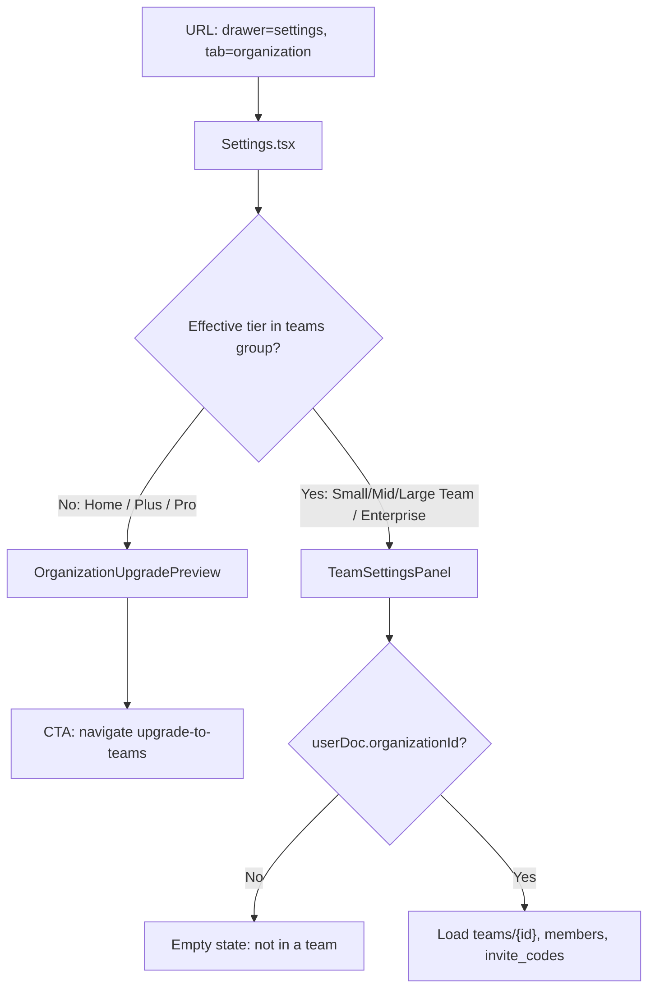

# Settings drawer — Organization tab (`/?drawer=settings&tab=organization`)

**Generated:** 2026-04-18  
**App repository:** `C:\Groundzy\app` (paths below are relative to that repo unless noted)  
**Purpose:** Single reference for product, design, and engineering on how the **Organization** segment of the unified Settings drawer is routed, gated, composed, backed by data, and instrumented — aligned with the current source.

**UX refactor (2026-04-18):** The team organization body is split into `components/` under `app/drawers/team-settings/` (profile card, members console, invites + join dialog, advanced section) with updated section order, i18n keys under `teamSettings.*`, seat-meter / upgrade hints on the profile card, and an explicit owner danger-zone line. **Phase 2 (members access):** managed rows use an outline trigger + **Popover** list to change role/preset (no inline `<select>`). See §12 for file paths.

---

## 1. URL, drawer identity, and legacy redirects

| Item | Behavior |
|------|----------|
| **Canonical URL** | `/?drawer=settings&tab=organization` |
| **Default tab** | If `tab` is missing or any value other than `organization`, the UI treats the tab as **`personal`** (`app/drawers/settings.tsx`). |
| **Legacy `team-settings`** | `?drawer=team-settings` is replaced in the browser with `settings` + `tab=organization` (`components/work-area/work-area-content.tsx`). |
| **Legacy `profile`** | `?drawer=profile` → `settings` + `tab=personal` (same file). |
| **Thin legacy drawer** | `app/drawers/team-settings.tsx` still exists for registration/redirects: it wraps `TeamSettingsPanel` in `DrawerShell` + `DrawerScrollArea` without the Settings tab chrome. Prefer `settings` + `tab=organization`. |

**Query param merge:** `useDrawer().updateParams` merges new keys into the current drawer `params` and calls `replaceDrawerUrlParams` with **`replace: true`** (`lib/drawer-context.tsx`), so switching tabs updates the URL without stacking history entries for each click.

---

## 2. Drawer registration (`lib/drawers.ts`)

The `settings` drawer is registered with optional string props `{ tab?: string }`, defaulting `tab` to `"personal"`, visible for the same tier set as the former Profile entry (`HOME_PLUS_PRO_AND_TEAMS`), informational archetype, full mobile state, sidebar-visible.

Relevant excerpt:

```529:539:c:\Groundzy\app\lib\drawers.ts
registerDrawer<{ tab?: string }>("settings", {
  label: "Settings",
  icon: Settings,
  order: 4,
  archetype: "informational",
  visibleForTiers: HOME_PLUS_PRO_AND_TEAMS,
  visibleInSidebar: true,
  visibleInBottomNav: false,
  defaultMobileState: "full",
  defaultProps: { tab: "personal" },
}, withRetry(() => import("@/app/drawers/settings").then(m => ({ default: m.Settings }))));
```

The standalone `team-settings` drawer remains registered for team tiers only, hidden from sidebar/bottom nav (`lib/drawers.ts` around lines 717–727).

---

## 3. High-level decision flow (Organization tab)



**Tier source:** `getEffectiveSubscriptionTier(userDoc)` then `isTierInGroup(tier, "teams")` (`lib/utils/tier-utils.ts`). Teams count only when subscription status is `active` or `trialing`; otherwise the user is treated as **Home** for gating, so they see the upgrade preview instead of org management.

---

## 4. Shell UI/UX: `Settings` component (`app/drawers/settings.tsx`)

### 4.1 Layout

- **Outer:** `DrawerShell` with `className="h-full flex flex-col min-h-0"` (column flex, full height, allow children to shrink for scroll).
- **Tab strip:** Fixed height region `shrink-0 border-b border-border px-2.5 pt-2.5 pb-2`, `role="tablist"`, `aria-label` from i18n key `settings.switcher.aria` (fallback: “Account settings”).
- **Switcher control:** Inner `div` with `flex rounded-lg border border-border bg-muted/40 p-0.5 gap-0.5` — segmented control aesthetic.
- **Tabs:** Two `button type="button"` elements with `role="tab"`, `aria-selected`, Lucide icons (`User` personal, `Building2` organization), labels truncated with `truncate`, `min-w-0`, `flex-1` for equal split.
- **Selected tab styling:** `bg-background text-foreground shadow-sm` vs unselected `text-muted-foreground hover:text-foreground`.
- **Scroll body:** `DrawerScrollArea` with `className="flex-1 min-h-0 p-2.5"` — org or personal content scrolls here.

### 4.2 Tab labels

- **Personal:** `usePersonNavLabel()` — prefers `@username` from `useUsername`, else Firestore/display name heuristics, else email local-part, else i18n `settings.fallbackPersonName` (“Account”).
- **Organization:** `useTeamLogo(organizationId)` snapshot name if present; else i18n `settings.orgNamePlaceholder` (“Your company”). `organizationId` resolves from `organization?.id` or `userDoc.organizationId`.

### 4.3 Analytics

On tab change, `logSettingsTabView(tab)` fires once per distinct tab (`useRef` guard), event `settings_tab_view` with `{ tab: "personal" | "organization" }` (`lib/firebase/analytics.ts`).

### 4.4 Organization branch content

1. **`tab === "organization" && !isTeamTier`** → `OrganizationUpgradePreview` (card with bullets + primary button calling `navigate("upgrade-to-teams")`). Copy is i18n-driven (`settings.orgPreview.*`).
2. **`tab === "organization" && isTeamTier`** → `TeamSettingsPanel` (no extra shell; panel adds its own padding).

---

## 5. Upgrade preview (non–team tier) — UI details

`OrganizationUpgradePreview` is a local function in `settings.tsx`:

- **Card:** `Card` / `CardHeader` / `CardContent`, `border-border/80`.
- **Header row:** `IconDefault` wrapping `Building2`, title `text-base font-semibold`.
- **Subtitle:** `text-sm text-muted-foreground`.
- **Bullets:** Disc list, muted text, three value props (members, workflows, pipeline).
- **CTA:** Full width on small screens (`w-full sm:w-auto`).

---

## 6. Team organization body — `TeamSettingsPanel` (`app/drawers/team-settings/TeamSettingsPanel.tsx`)

**Design note:** This component is intentionally **shell-agnostic** (comment in source): it is reused from the deprecated `TeamSettings` drawer and from **Settings → Organization**.

### 6.1 Early states

| State | UI |
|-------|-----|
| No `userDoc.organizationId` | `p-6` block: icon row (“Team Settings” / “You are not in a team”), body copy referencing invite flow at auth.groundzy.com. |
| Loading | Same header row, subtitle “Loading…”. |
| Error banner | Red-tinted `rounded-md` box above stack when `error` string set from failed actions or load. |

### 6.2 Confirmations

`ConfirmDestructiveDialog` is driven by `teamConfirm` union: remove member, leave team, revoke invite, transfer ownership, regenerate primary code, remove logo. Copy uses `teamSettings.*` i18n keys with English fallbacks in source.

### 6.3 Vertical structure (`SettingsDrawerStack`)

From `components/drawer-layout/settings-drawer-layout.tsx`:

- **Stack:** `space-y-8` between major groups.
- **Group:** `<section aria-labelledby>` with uppercase muted **title** (`text-xs font-semibold tracking-wide`), optional **description**, inner `space-y-4` for cards.

Sections in order:

1. **Organization** (`t("teamSettings.layout.groups.organization")`) — single `Card`:
   - **Business logo:** If `canInviteAndManageTeam` (`orgRoleAllows(role, "org.team.member.invite")` → admin + owner): circular preview `size-14`, hidden file input (`accept` from `getAcceptForContext("profile")`), text links “Upload logo” / “Change logo” with `Camera` / `Loader2`, “Remove” opens confirm. If user cannot manage but logo exists: read-only thumbnail.
   - **Team name** read-only.
   - **Your access** — `displayOrgMembershipLabel`; extra hint for `admin` role.
   - **Member limit** — `team.settings.maxMembers ?? 10`.

2. **Invite & member defaults** — title hard-coded English; description if user cannot update: “Only team admins and owners…”. Switches + select:
   - **Members can invite others** — `Switch`, `allowMemberInvites` (default on when not `false`).
   - **Require approval for new members** — `requireApproval === true`.
   - **Default access for invite joins** — `<select>` `view` vs `edit` mapped to `defaultPermissions`.
   - All gated by `canUpdateTeamSettings` (`getPermissionsForRole(..., "teamOrg", { orgPresetId }).teamSettings`).

3. **Members** — card header shows count `members.length / maxMembers`. Rows: name/email, controls:
   - If `canInviteAndManageTeam` and not owner/current user: **access** via outline button opening a **Popover** with product presets (same `updateMemberRole` mapping as the former inline picker; manager rows show “Manager” and choose a new preset to demote).
   - Else: read-only role label or “Owner”, “(you)”.
   - **Owner only:** `Transfer` outline button for non-self non-owner members (also in row overflow menu when managing).

4. **Permission presets (v4)** — **only if `userRole === "owner"`**: explanatory copy, collapsible “Advanced overrides” with preset/read matrix and per-member workflow read override selects (`inherit` / `allow` / `deny`) + clear button.

5. **Access & invites** — group description `teamSettings.invitesAdminOnly` when user cannot invite. If `canInviteAndManageTeam`: **Invite Codes** card with Share (primary or first code), New Code, per-code Copy / Share / Regenerate (primary) or Revoke.

6. **Workflow defaults** — if `canInviteAndManageTeam`: `WorkflowSettingsEditor` inside card; title/description reuse `profile.workflowSettings.*` strings.

7. **Danger zone** (`SettingsDangerZone`) — shown when `!canInviteAndManageTeam || userRole === "owner"`:
   - Styled destructive-tinted section.
   - **Leave Team** button only when `!canInviteAndManageTeam` (members without invite/manage capability can still leave).
   - When owner and can manage, description hints transfer (no leave button in that branch from current source).

### 6.4 Data loading (client)

On `orgId` + `user`:

- `getDoc(teams/{orgId})` → team document; if missing, `team` stays null (card still renders partial empty fields).
- Members: for each id in `team.members` (array or object keys), `getDoc(users/{uid})` for profile fields.
- `invite_codes` query `where("teamId", "==", orgId)`, filter `isActive`.

### 6.5 Mutations (high level)

| Action | Mechanism |
|--------|-----------|
| Member role / preset | `updateMemberRole` server action + optimistic local state + `invalidateQueries(["auth"])` |
| Team defaults | `updateTeamSettings` with `TeamSettingsPatch` |
| Workflow read overrides | `updateMemberWorkflowReadOverrides` |
| Remove member / leave / revoke / transfer / regenerate | respective server actions from `@/app/actions/team` |
| Logo | `uploadTeamLogo` / `removeTeamLogo` Firebase helpers + `invalidateQueries(["teamLogo", orgId])` |
| Invite share | Web Share API or clipboard fallback; toasts via `sonner` |

Id token: `getCurrentUser()?.getIdToken()` for server actions.

---

## 7. Supporting modules (reference)

| Concern | Location |
|---------|----------|
| Drawer URL replace | `lib/drawer-navigation.ts` (`replaceDrawerUrlParams`) |
| Legacy redirect | `components/work-area/work-area-content.tsx` (~321–332) |
| Team sidebar name/logo query | `hooks/useTeamLogo.ts` → `teams/{organizationId}` |
| Workflow settings hook | `hooks/useWorkflowSettings.ts` (teams access + org id) |
| Workflow form UI | `components/settings/WorkflowSettingsEditor.tsx` |
| Server-side team APIs | `app/actions/team.ts` (`'use server'`) |
| Tier / teams group | `lib/utils/tier-utils.ts` (`isTierInGroup` teams = Small/Mid/Large Team + Enterprise) |
| Policy / presets UI | `lib/groundzy/policy/*`, `lib/permissions-utils.ts` |

---

## 8. Full source: `app/drawers/settings.tsx`

```tsx
"use client";

import { useEffect, useMemo, useRef } from "react";
import { User, Building2 } from "lucide-react";
import { useAuth } from "@/hooks/useAuth";
import { useUsername } from "@/hooks/useUsername";
import { useTeamLogo } from "@/hooks/useTeamLogo";
import { useDrawer } from "@/lib/drawer-context";
import { DrawerShell, DrawerScrollArea } from "@/components/drawer-layout";
import { ProfilePanel } from "@/app/drawers/profile/ProfilePanel";
import { TeamSettingsPanel } from "@/app/drawers/team-settings/TeamSettingsPanel";
import { getEffectiveSubscriptionTier, isTierInGroup } from "@/lib/utils/tier-utils";
import { useI18n } from "@/components/i18n/i18n-provider";
import { cn } from "@/lib/utils";
import { Button } from "@/components/ui/button";
import { Card, CardContent, CardHeader } from "@/components/ui/card";
import { IconDefault } from "@/components/ui/icon-default";
import { logSettingsTabView } from "@/lib/firebase/analytics";

type SettingsTab = "personal" | "organization";

function usePersonNavLabel(): string {
  const { t } = useI18n();
  const { user, userDoc } = useAuth();
  const { data: username } = useUsername(user?.uid);
  if (!user && !userDoc) return t("settings.fallbackPersonName", undefined, "Account");
  const baseLabel =
    (username ? `@${username}` : null) ||
    userDoc?.displayName?.trim() ||
    user?.displayName?.trim() ||
    (userDoc?.profile?.firstName && userDoc?.profile?.lastName
      ? `${userDoc.profile.firstName} ${userDoc.profile.lastName}`.trim()
      : userDoc?.profile?.firstName?.trim() || userDoc?.profile?.lastName?.trim()) ||
    user?.email?.split("@")[0]?.trim() ||
    t("settings.fallbackPersonName", undefined, "Account");
  return baseLabel;
}

export function Settings() {
  const { t } = useI18n();
  const { userDoc, organization } = useAuth();
  const { params, updateParams, navigate } = useDrawer();

  const organizationId =
    (typeof organization?.id === "string" && organization.id ? organization.id : undefined) ||
    (typeof userDoc?.organizationId === "string" ? userDoc.organizationId : undefined);

  const { data: teamSidebar } = useTeamLogo(organizationId);
  const teamDisplayName = teamSidebar?.name?.trim() || "";

  const tab: SettingsTab = params.tab === "organization" ? "organization" : "personal";

  const lastLoggedTab = useRef<string | null>(null);
  useEffect(() => {
    if (lastLoggedTab.current !== tab) {
      logSettingsTabView(tab);
      lastLoggedTab.current = tab;
    }
  }, [tab]);

  const subscriptionTier = getEffectiveSubscriptionTier(userDoc ?? undefined);
  const isTeamTier = isTierInGroup(subscriptionTier, "teams");

  const personLabel = usePersonNavLabel();
  const orgLabel = useMemo(() => {
    if (teamDisplayName) return teamDisplayName;
    return t("settings.orgNamePlaceholder", undefined, "Your company");
  }, [teamDisplayName, t]);

  const setTab = (next: SettingsTab) => {
    if (next === "personal") {
      updateParams({ tab: "personal" });
    } else {
      updateParams({ tab: "organization" });
    }
  };

  return (
    <DrawerShell className="h-full flex flex-col min-h-0">
      <div
        className="shrink-0 border-b border-border px-2.5 pt-2.5 pb-2"
        role="tablist"
        aria-label={t("settings.switcher.aria", undefined, "Account settings")}
      >
        <div className="flex rounded-lg border border-border bg-muted/40 p-0.5 gap-0.5">
          <button
            type="button"
            role="tab"
            aria-selected={tab === "personal"}
            className={cn(
              "flex flex-1 min-w-0 items-center justify-center gap-1.5 rounded-md px-2 py-2 text-sm font-medium transition-colors",
              tab === "personal"
                ? "bg-background text-foreground shadow-sm"
                : "text-muted-foreground hover:text-foreground"
            )}
            onClick={() => setTab("personal")}
            title={personLabel}
            aria-label={t("settings.switcher.personalAria", { name: personLabel })}
          >
            <User className="size-4 shrink-0 opacity-80" aria-hidden />
            <span className="truncate">{personLabel}</span>
          </button>
          <button
            type="button"
            role="tab"
            aria-selected={tab === "organization"}
            className={cn(
              "flex flex-1 min-w-0 items-center justify-center gap-1.5 rounded-md px-2 py-2 text-sm font-medium transition-colors",
              tab === "organization"
                ? "bg-background text-foreground shadow-sm"
                : "text-muted-foreground hover:text-foreground"
            )}
            onClick={() => setTab("organization")}
            title={orgLabel}
            aria-label={t("settings.switcher.organizationAria", { name: orgLabel })}
          >
            <Building2 className="size-4 shrink-0 opacity-80" aria-hidden />
            <span className="truncate">{orgLabel}</span>
          </button>
        </div>
      </div>

      <DrawerScrollArea className="flex-1 min-h-0 p-2.5">
        {tab === "personal" && <ProfilePanel />}

        {tab === "organization" && !isTeamTier && (
          <OrganizationUpgradePreview
            onUpgrade={() => navigate("upgrade-to-teams")}
            t={t}
          />
        )}

        {tab === "organization" && isTeamTier && <TeamSettingsPanel />}
      </DrawerScrollArea>
    </DrawerShell>
  );
}

function OrganizationUpgradePreview({
  onUpgrade,
  t,
}: {
  onUpgrade: () => void;
  t: ReturnType<typeof useI18n>["t"];
}) {
  return (
    <Card className="border-border/80">
      <CardHeader className="pb-2">
        <div className="flex items-center gap-2">
          <IconDefault>
            <Building2 className="size-5" />
          </IconDefault>
          <span className="text-base font-semibold">
            {t("settings.orgPreview.title", undefined, "Work as a team")}
          </span>
        </div>
        <p className="text-sm text-muted-foreground font-normal pt-1">
          {t(
            "settings.orgPreview.subtitle",
            undefined,
            "You’re using Groundzy as an individual. Upgrade to unlock shared organization features."
          )}
        </p>
      </CardHeader>
      <CardContent className="space-y-4 pt-0">
        <p className="text-sm font-medium text-foreground">
          {t("settings.orgPreview.unlockLabel", undefined, "Upgrade to unlock:")}
        </p>
        <ul className="list-disc pl-5 space-y-1.5 text-sm text-muted-foreground">
          <li>{t("settings.orgPreview.bulletMembers", undefined, "Team members")}</li>
          <li>{t("settings.orgPreview.bulletWorkflows", undefined, "Shared workflows")}</li>
          <li>
            {t("settings.orgPreview.bulletPipeline", undefined, "Quotes → Jobs → Invoices")}
          </li>
        </ul>
        <Button type="button" className="w-full sm:w-auto" onClick={onUpgrade}>
          {t("settings.orgPreview.cta", undefined, "Upgrade to Teams")}
        </Button>
      </CardContent>
    </Card>
  );
}
```

---

## 9. Full source: deprecated wrapper `app/drawers/team-settings.tsx`

```tsx
"use client";

import { DrawerShell, DrawerScrollArea } from "@/components/drawer-layout";
import { TeamSettingsPanel } from "@/app/drawers/team-settings/TeamSettingsPanel";

/** @deprecated Prefer opening `settings` with `tab=organization`; kept for redirects. */
export function TeamSettings() {
  return (
    <DrawerShell className="h-full">
      <DrawerScrollArea className="flex-1 min-h-0">
        <TeamSettingsPanel />
      </DrawerScrollArea>
    </DrawerShell>
  );
}
```

---

## 10. Full source: settings drawer layout primitives (`components/drawer-layout/settings-drawer-layout.tsx`)

```tsx
"use client";

import * as React from "react";
import { cn } from "@/lib/utils";

/** Vertical spacing between major section groups in Settings-style drawers. */
export const SETTINGS_DRAWER_STACK_CLASS = "space-y-8";

/** Spacing between blocks inside one section group (cards, collapsibles). */
export const SETTINGS_GROUP_INNER_CLASS = "space-y-4";

export function SettingsDrawerStack({
  children,
  className,
}: {
  children: React.ReactNode;
  className?: string;
}) {
  return <div className={cn(SETTINGS_DRAWER_STACK_CLASS, className)}>{children}</div>;
}

export function SettingsDrawerGroup({
  title,
  titleId: titleIdProp,
  description,
  children,
  className,
}: {
  title: string;
  /** Optional stable id for aria-labelledby (defaults to React useId). */
  titleId?: string;
  description?: string;
  children: React.ReactNode;
  className?: string;
}) {
  const autoId = React.useId();
  const titleId = titleIdProp ?? autoId;
  return (
    <section
      className={cn(SETTINGS_GROUP_INNER_CLASS, className)}
      aria-labelledby={titleId}
    >
      <header className="space-y-1">
        <h2
          id={titleId}
          className="text-xs font-semibold uppercase tracking-wide text-muted-foreground"
        >
          {title}
        </h2>
        {description ? (
          <p className="text-xs text-muted-foreground">{description}</p>
        ) : null}
      </header>
      <div className={SETTINGS_GROUP_INNER_CLASS}>{children}</div>
    </section>
  );
}

export function SettingsDangerZone({
  title,
  description,
  children,
  className,
}: {
  title: string;
  description?: string;
  children: React.ReactNode;
  className?: string;
}) {
  const titleId = React.useId();
  return (
    <section
      className={cn(
        "rounded-lg border border-destructive/25 bg-destructive/[0.03] p-4",
        SETTINGS_GROUP_INNER_CLASS,
        className
      )}
      aria-labelledby={titleId}
    >
      <header className="space-y-1">
        <h2 id={titleId} className="text-xs font-semibold uppercase tracking-wide text-destructive">
          {title}
        </h2>
        {description ? (
          <p className="text-xs text-muted-foreground">{description}</p>
        ) : null}
      </header>
      <div className="space-y-2">{children}</div>
    </section>
  );
}
```

---

## 11. Related snippets

**`updateParams` (drawer context):**

```66:68:c:\Groundzy\app\lib\drawer-context.tsx
    const updateParams = (newParams: Record<string, string>) => {
      const mergedParams = { ...params, ...newParams };
      replaceDrawerUrlParams(router, pathname, drawerId, mergedParams, { replace: true });
```

**Legacy redirect:**

```321:332:c:\Groundzy\app\components\work-area\work-area-content.tsx
    // Unified Settings: legacy profile / team-settings URLs → settings + tab
    if (drawerParam === "profile") {
      const nextParams = { ...effectiveParams };
      if (!nextParams.tab) nextParams.tab = "personal";
      router.replace((pathname || "/") + buildDrawerUrl("settings", nextParams));
      return;
    }
    if (drawerParam === "team-settings") {
      router.replace(
        (pathname || "/") + buildDrawerUrl("settings", { ...effectiveParams, tab: "organization" })
      );
      return;
    }
```

**Analytics:**

```28:35:c:\Groundzy\app\lib\firebase\analytics.ts
/** Settings drawer segment: personal account vs organization (funnel with `drawer_view` settings). */
export function logSettingsTabView(tab: "personal" | "organization"): void {
  if (!analytics || !canSendAnalytics()) return;
  try {
    logEvent(analytics, "settings_tab_view", { tab });
  } catch {
    // non-fatal
  }
}
```

**Teams tier group:**

```99:116:c:\Groundzy\app\lib\utils\tier-utils.ts
export function isTierInGroup(
  tier: SubscriptionTier | null,
  group: 'home' | 'plus' | 'pro' | 'teams'
): boolean {
  if (!tier) return false;
  
  switch (group) {
    case 'home':
      return tier === 'Home';
    case 'plus':
      return tier === 'Plus';
    case 'pro':
      return tier === 'Pro';
    case 'teams':
      return tier === 'Small Team' || tier === 'Mid Team' || tier === 'Large Team' || tier === 'Enterprise';
    default:
      return false;
  }
}
```


## 12. Appendix — source layout after refactor (2026-04-18)

The organization tab body is split for maintainability. Verbatim code lives in the app repo under pp/drawers/team-settings/.

| Unit | Path |
|------|------|
| Orchestrator | pp/drawers/team-settings/TeamSettingsPanel.tsx |
| Profile header | pp/drawers/team-settings/components/OrganizationProfileCard.tsx |
| Members console | pp/drawers/team-settings/components/MembersSection.tsx |
| Invites + join defaults + invite dialog | pp/drawers/team-settings/components/InvitesSection.tsx |
| Advanced access (owner, collapsed) | pp/drawers/team-settings/components/AdvancedSection.tsx |
| Shared types | pp/drawers/team-settings/team-settings-types.ts |
| Member filter helper | pp/drawers/team-settings/member-filter.ts |

**Section order:** Organization profile, Members & access, Invites & join settings, Workflow defaults, Advanced access controls (owner), Danger zone.

**Invite sheet:** Dialog wizard (default access preset, then copy or share). Profile **Invite member** opens the sheet via InvitesSection orwardRef / useImperativeHandle.

**Strings:** lib/i18n/messages.ts under 	eamSettings.* (en / es / fr).
