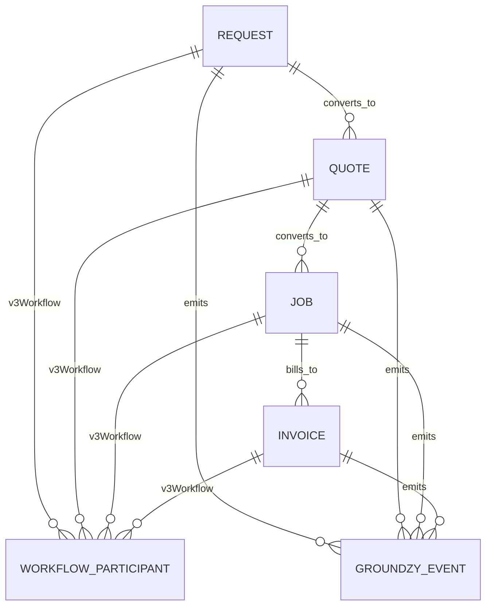
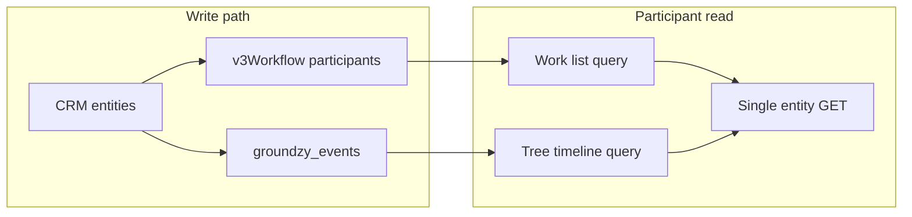

# Canonical workflow schema (v3)

**Status:** Architecture — field names and enums are illustrative until product + security sign-off.  
**Audience:** Backend, Firestore rules, and client engineers implementing participant **Work**, tree workflow timeline, and internal ops on the same truth.

**Companion:** [Workflow participation & external access (v3)](./workflow-participation-external-access-v3.md) (product model, entry points, identity). This document specifies **Firestore layout**, **participants**, **events**, and **indexes**.

### Locked implementation decisions (participant rollout)

| Decision | Choice |
|----------|--------|
| **Index / query** | **Embedded** `participantPrincipalIds` on each canonical doc (plus full `v3Workflow`). No `user_workflow_refs` in v1; optional projection later. |
| **Who writes `v3Workflow` / `participantPrincipalIds`** | **Trusted server paths only** — Groundzy v3 **projection handlers** (`lib/groundzy/projections/handlers/workflow/*`) and Admin/backfill jobs. Not client SDK. Rules block mutating participant fields on update (except global admin). |
| **Principal key strings** | Single standard via [`lib/workflow/principal-keys.ts`](../../lib/workflow/principal-keys.ts): `uid:…`, `org:…`, `email:…` (normalized). |
| **External tokens** | Separate identity layer; not raw secrets in `participantPrincipalIds` — see [workflow participation §8](./workflow-participation-external-access-v3.md). |
| **Work UI** | Drawer **`participant-work`** (“Work”); item drill-down uses existing **`view-request`**, **`view-quote`**, **`view-job`**, **`view-invoice`** (participant route contract). |
| **Firestore rules** | For `requests` / `quotes` / `jobs` / `invoices`, **`allow read` is split**: (1) `isParticipantOnWorkflowDoc()` — **only** `resource.data` (no `get()` / `exists()`), so `array-contains` + `orderBy` Work queries validate; (2) `workflowDocNonParticipantRead()` — team / `databaseCode` / solo / global admin. A single `allow read` mixing participant checks with `workflowTeamAccess()` (which uses `get()`) can cause **permission-denied** on those queries. |

---

## 1. Context (today’s codebase)

| Collection | Types | Notes |
|------------|-------|--------|
| `requests/{id}` | [`Request`](../../types/request.ts) | `organizationId`, `clientId`, `propertyId`, `requestItems[]` with `treeId` / `zoneId` |
| `quotes/{id}` | [`Quote`](../../types/quote.ts) | Lineage to request; line items may reference trees |
| `jobs/{id}` | [`Job`](../../types/job.ts) | Lineage to quote; `treeIds` / line items |
| `invoices/{id}` | [`Invoice`](../../types/invoice.ts) | `jobId`, client, amounts |

- **Operational scope** today is effectively **`organizationId`** + Firestore rules (`workflowTeamAccess`, etc.) — see [firestore-collections.md](../reference/firestore-collections.md).
- **Append-only events:** [`groundzy_events`](../../lib/groundzy/server/append-event.ts) with workflow command types (`workflow.request_created`, `workflow.quote_created_from_request`, …) and **subjects** (`entityType` + id). Idempotency via `groundzy_event_idempotency`.
- **Projections:** `work_items` and tree timeline projections — **derived**, not participant truth ([workflow participation §2](../architecture/workflow-participation-external-access-v3.md)).

**Progress:** v3 append pipeline projections now write **`v3Workflow`** and top-level **`participantPrincipalIds`** for new workflow entities. Legacy documents without these fields rely on org-scoped rules until **backfill** ([§8](#8-migration-backfill)).

---

## 2. Design goals

1. **Single canonical document** per request / quote / job / invoice (no move of truth to `work_items` for visibility).
2. **Explicit participants** + **denormalized principal ids** for Firestore queries (`array-contains` / composite indexes).
3. **Lifecycle** continues through **`groundzy_events`** append path; extend command catalog incrementally.
4. **Rules-first** reads: participant access = match on **principal**, not only org membership.
5. **Backward compatible:** versioned nested object (`v3Workflow`) so legacy clients ignore unknown fields until migrated.

---

## 3. Firestore structure

### 3.1 Canonical collections (unchanged paths)

Truth remains at:

- `requests/{requestId}`
- `quotes/{quoteId}`
- `jobs/{jobId}`
- `invoices/{invoiceId}`

Existing fields (`organizationId`, `clientId`, `propertyId`, status, amounts, `requestItems`, line items, `workItemIds`, …) stay. **`organizationId`** remains the legacy field used everywhere today; new code may treat **`v3Workflow.managingOrganizationId`** as the semantic “ops owner” when populated (usually equal to `organizationId`).

### 3.2 Extension block: `v3Workflow` (nested on each entity)

Add a single optional object **`v3Workflow`** on each of the four collections (same shape where applicable):

| Field | Type | Purpose |
|-------|------|---------|
| `schemaVersion` | `number` | Start at `1`; bump when shape changes. |
| `managingOrganizationId` | `string` | Org that operates this workflow internally (typically same as `organizationId`). |
| `participants` | `WorkflowParticipant[]` | See §4. |
| `participantPrincipalIds` | `string[]` | Denormalized stable keys for queries — see §4.3. |
| `linkedTreeIds` | `string[]` | Denormalized tree ids for this workflow (from request/quote/job line items). |

**Why nested:** Avoids collisions with existing top-level fields; easy to strip in exports or legacy code paths.

### 3.3 Optional: `user_workflow_refs` (scale / fan-out)

If listing **Work** across four collections becomes expensive or index explosion is unacceptable, introduce a **denormalized ref doc** per user (or per principal):

**Path:** `user_workflow_refs/{uid}/items/{refId}`

| Field | Purpose |
|-------|---------|
| `entityType` | `request` \| `quote` \| `job` \| `invoice` |
| `entityId` | Source document id |
| `managingOrganizationId` | For display / routing |
| `status` | Copy for list row |
| `updatedAt` | Order Work list |
| `linkedTreeIds` | Optional filter |
| `summaryTitle` | Short label for list |

**Consistency:** Written in the same transaction as the canonical doc update, or via a trusted Cloud Function. **Start without** this collection if the team prefers only embedded `participantPrincipalIds` + composite indexes on each entity collection.

### 3.4 `groundzy_events` (append-only)

- **No change to collection name.** Continue using [`append-event`](../../lib/groundzy/server/append-event.ts) pipeline, idempotency, and correlation ids.
- **Extend** allowed command types over time for participant-relevant transitions (examples: `quote_sent`, `quote_viewed`, `quote_accepted`, `invoice_paid`). Payloads must include **`workflowEntityType`**, **`workflowEntityId`**, **`actorPrincipal`**, and optional **`treeIds`** for projections.
- **Tree timeline:** Prefer querying **projections** keyed by `treeId` + time (existing patterns under `lib/groundzy/projections`) or filtering events whose payload/subject includes the tree — product chooses one read path and indexes accordingly ([workflow participation §7.5](./workflow-participation-external-access-v3.md)).

---

## 4. Participant model

### 4.1 `WorkflowParticipant` (illustrative TypeScript shape)

```ts
/** Embedded in requests | quotes | jobs | invoices under v3Workflow.participants */
interface WorkflowParticipant {
  /** Stable within this workflow document. */
  id: string;

  principalType: "groundzy_user" | "email_token" | "org_internal";

  /** Meaning depends on principalType:
   * - groundzy_user: Firebase auth uid
   * - email_token: opaque id referencing a token doc or hashed email key (rules must resolve)
   * - org_internal: organizationId for team/pro org row
   */
  principalId: string;

  role: "customer" | "pro_org" | "assignee" | "viewer" | string; // product-defined enum

  /** Explicit flags; may be derived from role + entity type in application code. */
  permissions: {
    canView: boolean;
    canAccept?: boolean;
    canPay?: boolean;
    canComment?: boolean;
  };

  /** Optional denormalized links when resolved */
  linkedClientId?: string;
  linkedHomeownerUserId?: string;
}
```

### 4.2 Who writes participants

- **Internal creation** (pro/team): ensure `pro_org` + `customer` (or CRM-linked homeowner) rows exist.
- **CRM sync:** When `clients.homeownerUserId` or default-pro share resolves, add/update `groundzy_user` participant and refresh `participantPrincipalIds`.
- **Append pipeline (implemented):** On `workflow.request_created`, `workflow.quote_created_from_request`, `workflow.quote_created`, `workflow.job_created_from_quote`, and `workflow.invoice_created_from_job`, the server reads `clients/{clientId}` inside the same Firestore transaction and merges `resolvedHomeownerUserId` into the stored event payload. Projection handlers pass that uid into `buildV3WorkflowPayload`, so `participantPrincipalIds` includes `uid:<homeowner>` when the org’s client row has `homeownerUserId`. Clients cannot spoof `resolvedHomeownerUserId` (Zod payloads omit it).
- **External quote / portal:** insert `email_token` participant until claim merges to `groundzy_user`.

### 4.3 `participantPrincipalIds` (denormalized query keys)

Stable string tokens for **`array-contains`** queries, e.g.:

- `uid:{firebaseUid}`
- `email:{normalizedHashOrOpaqueTokenRef}`
- `org:{organizationId}` (internal operators)

**Maintenance:** On every participant array change, recompute this list. **Max array size:** stay within Firestore limits; if exceeded, move to **`user_workflow_refs`** only.

### 4.4 Permission matrix (product-owned)

Define a matrix **role × entity type × action** (view / accept / pay / …). This document does not lock values — security rules must align with the matrix. See [workflow participation §8](./workflow-participation-external-access-v3.md).

---

## 5. Event structure (`groundzy_events`)

### 5.1 Existing pattern

- Commands parsed in [`parseAppendCommand`](../../lib/groundzy/events/validate.ts); subjects built in [`buildSubject`](../../lib/groundzy/server/append-event.ts) (e.g. `entityType: "quote"`, `id: quoteId`).
- Events stored in **`groundzy_events/{eventId}`** with schema version and payload.

### 5.2 Extensions for participant visibility

For each new lifecycle event:

- **Type:** namespaced string, e.g. `workflow.quote_sent`.
- **Payload:** include `quoteId`, `managingOrganizationId`, `actorPrincipal` `{ principalType, principalId }`, optional `treeIds[]`.
- **Idempotency:** reuse existing idempotency key strategy.

### 5.3 Read models

| Surface | Source |
|---------|--------|
| Global **Work** | Query canonical docs via `participantPrincipalIds` or `user_workflow_refs` |
| Tree timeline | **Events** or **tree timeline projection** filtered by `treeId` — **events primary** per [§7.5](./workflow-participation-external-access-v3.md) |
| Single item | **GET** canonical `quotes/{id}` etc. + rules evaluate `participants` |

---

## 6. Indexes (`firebase/firestore.indexes.json`)

Add **after** query shapes are finalized (Firestore requires composite indexes for `array-contains` + `orderBy`).

| Query | Collection | Fields (illustrative) |
|-------|------------|-------------------------|
| Participant Work list (per entity type) | `quotes` | `v3Workflow.participantPrincipalIds` **array-contains** + `updatedAt` DESC — **or** flatten `participantPrincipalIds` top-level if rules forbid nested index paths |
| Same | `jobs`, `invoices`, `requests` | Same pattern — **or** avoid four indexes by using **`user_workflow_refs`** only: `user_workflow_refs/{uid}/items` with `updatedAt` DESC |
| Internal ops (existing) | each | `organizationId` + `status` + `updatedAt` (already common) |
| Events by tree | projection or `groundzy_events` | `treeIds` array-contains + `occurredAt` / `createdAt` DESC — **confirm** actual field names on event docs |

**Note:** Firestore index paths may require **flattening** `participantPrincipalIds` to top-level on the document if composite indexes cannot target nested `v3Workflow.*` — product decision during implementation.

**Collection group:** Use only if introducing subcollections with a shared name across parents; otherwise top-level **collection** indexes.

---

## 7. Security rules (follow-up spike)

**Not implemented in this schema doc.** Required follow-up:

- **`isParticipantOnWorkflow(resource, auth)`** — true if `request.auth.uid` (or custom claims) matches a participant principal, or token claim matches `email_token` participant.
- **`isInternalOperatorForOrg(orgId, auth)`** — existing team/org checks.
- **External / token reads** — align with [quote-external-delivery-and-homeowner-signup.md](./quote-external-delivery-and-homeowner-signup.md) and portal tokens.

Staged rollout + feature flags recommended to avoid regressing org-only workflow reads.

---

## 8. Migration (backfill)

1. **Backfill `v3Workflow.managingOrganizationId`** from `organizationId`.
2. **Infer initial participants:** internal operator = org; customer from `clientId` → `clients` → `homeownerUserId` when present.
3. **Compute `participantPrincipalIds`** and **`linkedTreeIds`** from existing line items / `requestItems`.
4. **Emit** `groundzy_events` only for **new** transitions (optional historical replay is a separate job).

---

## 9. Entity relationship (conceptual)



---

## 10. Read path (target)



---

## 11. Related documentation

| Document | Relevance |
|----------|-----------|
| [workflow-participation-external-access-v3.md](./workflow-participation-external-access-v3.md) | Product model, Work vs tree, §7.4 single item view |
| [home-plus-to-pro-teams-linking.md](./home-plus-to-pro-teams-linking.md) §9 | Interim consumer tree guardrails |
| [firestore-collections.md](../reference/firestore-collections.md) | Current collection fields |
| [quote-external-delivery-and-homeowner-signup.md](./quote-external-delivery-and-homeowner-signup.md) | External identity / tokens |

---

## Document history

| Date | Change |
|------|--------|
| 2026-04-04 | Initial canonical schema: v3Workflow, participants, events, indexes, migration, rules follow-up |
