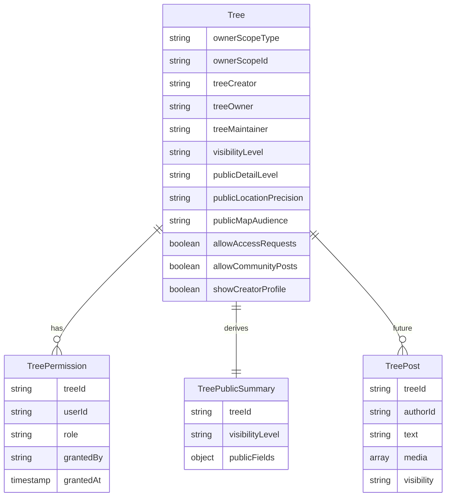

# Visibility & Permission Model v2

This document defines the v2 visibility and permission model for Groundzy trees. It serves as the product truth for evolving from the current mechanism-based system to a first-class permission model that supports:

- One world map with graduated visibility
- Strong privacy controls
- Map discoverability distinct from social/community visibility
- Explicit roles for collaborators

**Status**: Design specification for future implementation. No code changes yet.

---

## Table of Contents

1. [Vision and Principles](#1-vision-and-principles)
2. [Core Concepts](#2-core-concepts)
3. [Current State Summary](#3-current-state-summary)
4. [Visibility Model](#4-visibility-model)
5. [Audience Model](#5-audience-model)
6. [Permission Model](#6-permission-model)
7. [Data Model (v2 Schema)](#7-data-model-v2-schema)
8. [Tree Lifecycle](#8-tree-lifecycle)
9. [Public Summary Tiers](#9-public-summary-tiers)
10. [Map Visibility Mechanics](#10-map-visibility-mechanics)
11. [Privacy Policies](#11-privacy-policies)
12. [Security Rules Model](#12-security-rules-model)
13. [Moderation Model](#13-moderation-model)
14. [Auditability](#14-auditability)
15. [Public Content Settings (Axis 2)](#15-public-content-settings-axis-2)
16. [Defaults by User Type](#16-defaults-by-user-type)
17. [Example Scenarios](#17-example-scenarios)
18. [Migration Strategy](#18-migration-strategy)
19. [Implementation Phases](#19-implementation-phases)
20. [Architecture Risks](#20-architecture-risks)

---

## 1. Vision and Principles

### Goals

**Goal A: Global discoverability**

People should be able to open the map, zoom in, and discover trees around the world.

**Goal B: Owner control**

The person or organization who created the tree should control how visible that tree is, what others can see, and what others can do.

### Core Principle

**Map discoverability ≠ social visibility**

A tree can be discoverable on the map without being socially promoted. A user can contribute socially without getting edit rights to the canonical record. This distinction honors all three goals: global tree map, privacy, and community.

### Four Orthogonal Axes

The model separates concerns into four axes:

1. **Visibility** — Who can see what (map marker, public summary, community surfaces)
2. **Public content settings** — Per-tree toggles for detail level, location precision, access requests
3. **Collaborator roles** — What authorized users can do (owner, manager, editor, contributor, viewer)
4. **Content ownership** — Canonical tree record vs community content (posts, observations)

---

## 2. Core Concepts

### Tree

The canonical entity. Owner-scoped via `ownerScopeType` and `ownerScopeId` (user or team).

### Canonical Record

The structured "truth" of the tree:

- Species, location, measurements
- Health, risk assessment
- Ownership, work history
- Property/client linkage

Tighter permissions apply. Only owners and users with appropriate roles can edit.

### Public Summary

A derived view for non-authorized users. Tiered by `publicDetailLevel` (minimal vs rich). Stored in `tree_public_summaries` and used for map markers and restricted-tree views.

### Community Content (Future)

The social layer — posts, observations, comments — separate from the canonical record. Looser contribution rules; users may add content without edit rights to the tree.

---

## 3. Current State Summary

The current implementation (see [tree-visibility-privacy-sharing.md](../features/tree-visibility-privacy-sharing.md)) provides these building blocks:

| Component | Purpose |
|-----------|---------|
| `trees` | Full canonical record |
| `tree_public_summaries` | Public/restricted map layer; readable by all authenticated users |
| `shared_data.sharedWith` | Collaborator access — flat array of user IDs, no roles |
| `tree_access_requests` | Request/approve flow for access |
| `tree_share_links` | External share links; redeem via API |
| `restricted-tree` vs `view-tree` | Two UX states: limited info vs full access |

The v2 model makes visibility and roles first-class concepts instead of side effects of these mechanisms.

---

## 4. Visibility Model

### 4a. Visibility Levels

Every tree has an explicit `visibilityLevel` (2-state model):

| Level | Who sees | Use cases |
|-------|----------|-----------|
| `private` | Owner + team members + explicitly shared collaborators only | Client properties, sensitive locations, internal arborist work |
| `public` | All signed-in Groundzy users | Discoverable on map and in community; full passport, activity, ecology |

### 4b. Visibility Behavior Matrix

**This is the cornerstone of the spec.** Engineers must implement to this matrix.

| Visibility | Map marker | Public summary | Access request | Community surfaces |
|------------|------------|----------------|----------------|--------------------|
| `private` | Yes, zoom ≥ 18 (minimal marker) | Minimal (GZ-TIN only) | Optional (owner setting) | No |
| `public` | Yes, zoom ≥ 14 | Rich (passport, activity, ecology) | Optional (owner setting) | Yes |

**Definitions:**

- **Map marker**: Whether a marker appears on the map for non-authorized users at the given zoom.
- **Public summary**: Tier of data exposed (minimal = Tier 1, rich = Tier 2).
- **Access request**: Whether non-authorized users can request full access. **Only authenticated users** may submit access requests (prevents spam). When "yes", any authenticated user may request; when "optional", owner may enable via `allowAccessRequests`.
- **Community surfaces**: Whether the tree can appear in feeds, discovery, profiles.

---

## 5. Audience Model

Audience types must be defined explicitly. Without this, privacy rules become ambiguous.

### Audience Types

| Audience | Definition |
|----------|------------|
| `anyone` | Public internet; unauthenticated |
| `authenticated` | Signed-in Groundzy users |
| `verified` | Authenticated + verified (future) |
| `followers` | Users who follow the creator (future) |
| `team_members` | Same organization as tree owner |
| `shared_collaborators` | Users with a `tree_permission` role |

### Visibility → Audience Mapping

| Visibility | Who can see marker | Who can see summary |
|------------|--------------------|---------------------|
| `private` | `team_members`, `shared_collaborators` (full tree only; minimal marker at zoom ≥ 18) | N/A |
| `public` | `authenticated` (at zoom ≥ 14) | Rich; map and community |

---

## 6. Permission Model

### 6a. Collaborator Roles

Replace `shared_data.sharedWith` with `tree_permissions/{treeId}/members/{userId}`:

| Role | Capabilities |
|------|--------------|
| `owner` | Full control; edit all data; delete/archive; transfer ownership; change visibility; manage roles; set public/community options |
| `manager` | Edit tree; manage public photos/posts; approve access requests; invite viewers/editors/contributors; archive (not transfer) |
| `editor` | Update tree record; add photos; add history; edit health/risk. Cannot transfer ownership, change visibility, or manage roles |
| `contributor` | Add photos; add observations; add comments/field notes; submit suggested edits. Cannot edit canonical metadata directly (see [Contributor Suggested Edits](#contributor-suggested-edits)) |
| `viewer` | Read-only full access; view non-public details; maybe export or save |

### 6b. Team Role Inheritance

When team membership and tree permission both apply:

**Permission precedence** (evaluate in order; stop at first match):

1. **Owner scope** — User is tree owner (org or databaseCode) → full access
2. **Team role** — User is team member → team role applies
3. **Tree permission** — User has explicit `tree_permission` → tree role applies
4. **Public visibility** — Tree is public → public summary only

**When both team role and tree permission apply**: Use **min(role)** — the more restrictive wins. Role order from least to most restrictive: owner, manager, editor, contributor, viewer.

| Team role | Tree permission | Effective role |
|-----------|-----------------|----------------|
| manager | viewer | viewer |
| editor | contributor | contributor |
| member | (none) | member |

**Rationale**: Most restrictive wins is safer. A tree owner who grants a user `viewer` on a specific tree intends to limit that user, even if the user has a broader team role.

### 6c. Tree Identity vs Ownership

Anticipate municipal, heritage, and public inventories where ownership ≠ authorship:

| Concept | Definition |
|---------|------------|
| `treeOwner` | Who controls visibility and permissions (org or user) |
| `treeCreator` | Who originally added the tree (may differ from owner) |
| `treeMaintainer` | Who is responsible for updates (e.g. city arborist vs citizen contributor) |

Example: City arborist adds a tree; citizen adds photos; another arborist updates health. The schema should support these distinctions.

### 6d. Contributor Suggested Edits

Contributors can submit suggested edits but cannot modify the canonical record directly. Suggested edits are stored separately and require owner/editor approval.

**Storage**: `tree_edit_suggestions/{treeId}/suggestions/{suggestionId}` (or equivalent subcollection). Each suggestion contains: field path, proposed value, author, status (pending/approved/rejected).

**Flow**: Contributor submits → suggestion created → owner/editor reviews → approve merges into tree; reject discards. Alternative: use `tree_post` with type `suggestion` for simpler initial implementation.

---

## 7. Data Model (v2 Schema)



### Collections

- **trees/{treeId}**: Canonical record with new visibility and ownership fields.
- **tree_permissions/{treeId}/members/{userId}**: Per-tree collaborator roles (replaces `shared_data`).
- **user_tree_permissions/{userId}/trees/{treeId}** (future): Mirror index for user-centric queries ("trees shared with me", "trees I can edit"). Firestore is weak at reverse lookups; this avoids expensive collection-group or cross-queries. Sync when granting/revoking tree permissions.
- **tree_public_summaries/{treeId}**: Derived public view; document ID = treeId.
- **tree_edit_suggestions/{treeId}/suggestions/{suggestionId}** (future): Contributor suggested edits; see [Contributor Suggested Edits](#contributor-suggested-edits).
- **tree_post** (future): Community content; separate from canonical record.

### Public Summary Derivation

**Responsibility**: A **Cloud Function** (or Firestore trigger) must write/update `tree_public_summaries` when a tree is created or updated. Client-side writes are not sufficient — summaries would drift out of sync.

**Flow**: `onDocumentWritten(trees/{treeId})` → derive summary from tree + `visibilityLevel` + `publicDetailLevel` → write `tree_public_summaries/{treeId}`.

Visibility change or `publicDetailLevel` change must also trigger a summary rebuild.

---

## 8. Tree Lifecycle

Trees move through states that affect visibility and behavior:

| State | Description | Visibility behavior |
|-------|-------------|---------------------|
| `created` | Newly added | Follows `visibilityLevel`; summary derived |
| `active` | Normal state | Full behavior per visibility matrix |
| `archived` | Owner archived (owner-only) or soft-deleted | No public marker; no public summary for archived trees; owner/shared users may still access |
| `deleted` | Soft delete (`isDeleted: true`) | Excluded from all queries; summary removed or marked deleted |

**Archived trees**: When `archivedByOwnerAt` is set, the tree disappears from the owner's main list but shared users retain access. Public visibility is disabled — no marker, no summary for non-authorized users.

---

## 9. Public Summary Tiers

### Tier 1: Minimal

Visible to non-authorized users:

- Approximate or exact point (per `publicLocationPrecision`)
- Species/common name
- Height band (not exact value)
- GZ-TIN
- Optional thumbnail

Hidden: owner info, health details, notes, history, property/client linkage, internal media, private measurements.

### Tier 2: Rich

Visible to non-authorized users:

- Species
- Photos marked public
- Basic measurements
- Public description
- Public care highlights
- General location label

Hidden: internal service history, customer/client details, private notes, internal risk assessment.

### Community Tier (Future)

Visible in feed/profile contexts:

- Public photos
- Captions/posts
- Public tags
- Creator profile (if `showCreatorProfile`)

---

## 10. Map Visibility Mechanics

**"One map, all trees of the world"** introduces a scalability problem. The model must address:

### Zoom Thresholds

Per visibility level (from behavior matrix):

- `private`: zoom ≥ 18
- `public`: zoom ≥ 14

### Clustering

Aggregate markers at low zoom to avoid rendering thousands of points. Show cluster counts; expand on zoom.

### Spatial Indexes

- **H3 tiling** or **geohash** for server-side queries
- Enables tile-based or bounds-based fetching

### Server-Side Queries

Cannot load all trees client-side. Need:

- Tile-based API (e.g. `/api/map/tiles/{z}/{x}/{y}`)
- Or bounds-based API with pagination/limits

Without this, the model becomes technically unrealistic at scale.

### Future Geospatial Indexing

A flat `tree_public_summaries/{treeId}` collection may not scale for geospatial queries at millions of trees. Document the intended direction for future implementation:

| Option | Structure | Use case |
|--------|-----------|----------|
| **A** | `tree_public_summaries/{h3Cell}/{treeId}` | H3-cell partitioned; query by cell |
| **B** | `map_tiles/{tileId}/trees[]` | Pre-aggregated tile documents |
| **C** | External geo index (Elasticsearch, PostGIS) | Full-text + spatial; sync from Firestore |

Not required for v2; choose when map scaling becomes a bottleneck.

---

## 11. Privacy Policies

### 11a. Location Privacy Policy

Trees are physical locations. Coordinate exposure must be explicit.

**Storage vs exposure**: The canonical `trees` document always stores **exact** coordinates. Privacy is enforced at **read time**: the API or public summary returns coordinates according to policy. The client never receives coordinates more precise than the policy allows.

| Visibility | Stored | Returned to non-authorized users |
|------------|--------|-----------------------------------|
| `private` | Exact | Exact only at zoom ≥ 18 |
| `public` | Exact | Exact or approximate based on `publicLocationPrecision` owner setting |

**Map markers**: Marker coordinates come from the public summary or tile API, which applies the above policy. The client does not receive exact coordinates for approximate trees.

### 11b. Other Privacy

- **Photo-level controls**: Each photo can be public or private.
- **Identity exposure**: Tree visibility and profile visibility are separate toggles. A user can share trees without exposing their name/profile.

---

## 12. Security Rules Model

### Permission Resolution Algorithm

Rules must **resolve to a single effective role** before granting access. Do not use additive logic (e.g. "if team OR permission then allow").

**Step 1 — Resolve effective role**:

```
effectiveRole = null
IF isOwner(user, tree) THEN effectiveRole = owner; STOP
IF isTeamMember(user, tree) THEN teamRole = getTeamRole(user, tree)
IF hasTreePermission(user, tree) THEN treeRole = getTreePermissionRole(user, tree)
IF teamRole AND treeRole BOTH exist THEN effectiveRole = min(teamRole, treeRole)  // most restrictive
ELSE IF teamRole THEN effectiveRole = teamRole
ELSE IF treeRole THEN effectiveRole = treeRole
```

**Step 2 — Check effective role for requested action** (read/update/etc.).

**Permission precedence** (evaluate in order):

| Precedence | Condition | Result |
|------------|-----------|--------|
| 1 | Owner (org or databaseCode) | Full access |
| 2 | Team member | Team role |
| 3 | Tree permission | Tree role |
| 4 | Both team + tree permission | **min(role)** — most restrictive |
| 5 | Public visibility only | Public summary; no full tree |

### canReadTree(user, tree)

```
effectiveRole = resolveEffectiveRole(user, tree)
IF effectiveRole = owner OR isGlobalAdmin(user) THEN allow (full tree)
IF effectiveRole IN [manager, editor, contributor, viewer] THEN allow (full tree, per role)
IF effectiveRole = null AND tree.visibilityLevel = 'public' AND user IN audience THEN allow (public summary only)
ELSE deny
```

### canUpdateTree(user, tree)

```
effectiveRole = resolveEffectiveRole(user, tree)
IF effectiveRole = owner OR isGlobalAdmin(user) THEN allow
IF effectiveRole IN [manager, editor] THEN allow
ELSE deny
```

### canCreateTree(user, data)

```
IF isAuthenticated(user) AND (data.ownerScopeId matches user's org/databaseCode) THEN allow
ELSE deny
```

### tree_public_summaries

```
Read: IF isAuthenticated(user) AND tree.visibilityLevel allows THEN allow
Write: Only tree owner (same as tree write permission)
```

### tree_permissions

```
Read: Tree owner OR user in members
Create/Update: Tree owner only
```

---

## 13. Moderation Model

Once `public` trees exist, user-generated content requires moderation:

| Concern | Approach |
|---------|----------|
| Reporting trees | Flag for spam, incorrect data, sensitive location |
| Reporting photos | Flag for inappropriate content |
| Spam control | Rate limits, automated detection |
| Vandalism prevention | Edit history, revert capability |
| Abusive content removal | Take-down flow, appeal process |
| Escalation | Path for disputes; support contact |

---

## 14. Auditability

Track changes for security and enterprise customers:

| Event | Storage |
|-------|---------|
| Permission granted/revoked | `tree_permission_history` or extend `grantedBy`, `grantedAt` |
| Visibility changed | `visibility_change_history` |
| Tree edited | Existing history; ensure actor is recorded |

---

## 15. Public Content Settings (Axis 2)

Per-tree settings that control what non-owners see:

| Setting | Type | Purpose |
|---------|------|---------|
| `publicDetailLevel` | `"minimal"` \| `"rich"` | Tier of public summary |
| `publicLocationPrecision` | `"exact"` \| `"approximate"` | Coordinate exposure |
| `publicMapAudience` | `"authenticated"` \| `"anyone"` | For `public` trees; default `authenticated` |
| `allowAccessRequests` | boolean | Whether users can request full access |
| `allowCommunityPosts` | boolean | Whether community can post (future) |
| `showCreatorProfile` | boolean | Show creator in public/community views |
| `showPublicPhotos` | boolean | Include photos in public summary |

---

## 16. Defaults by User Type

| User type | Default visibility | Default access requests |
|-----------|--------------------|-------------------------|
| Individual (Home/Plus) | `public` | On |
| Pro/Team | `private` | Off or optional |
| Community-first (opt-in) | `public` | On |

---

## 17. Example Scenarios

These scenarios help developers understand how the system behaves:

| Scenario | Actors | Visibility | Outcome |
|----------|--------|------------|---------|
| **Citizen adds tree in city park** | Individual user | `public` (default) | Tree discoverable at zoom ≥ 14; full passport; access requests on |
| **Arborist adds private client tree** | Pro/team user | `private` (default) | No public marker; only owner and shared collaborators see it |
| **Community member adds photos to public tree** | Contributor role | Tree is `public` | Photos added as community content; no edit rights to canonical record |
| **Tree transferred between organizations** | Owner | Any | Ownership changes; previous owner added to `tree_permissions` as viewer; visibility unchanged unless new owner changes it |

---

## 18. Migration Strategy

When implementing (migrate-all approach):

1. Add new fields to `trees` with defaults; backfill existing trees.
2. Create `tree_permissions` collection; migrate `shared_data.sharedWith` → members with role `viewer` (or `editor` to preserve current behavior).
3. Update `tree_public_summaries` to derive from `visibilityLevel` + `publicDetailLevel`.
4. Update Firestore rules to check `tree_permissions` and `visibilityLevel`.
5. Deprecate `shared_data` after migration.
6. Update all client code (hooks, drawers, map markers).

---

## 19. Implementation Phases

| Phase | Scope |
|-------|-------|
| **Phase 1** | Visibility levels + public settings on trees; derive public summaries; visibility behavior matrix |
| **Phase 2** | `tree_permissions` + roles; migrate from `shared_data`; team inheritance; security rules |
| **Phase 3** | Map visibility mechanics (clustering, spatial indexes, tile API) |
| **Phase 4** | Community content structure (`tree_post`); moderation model; auditability |

---

## 20. Architecture Risks

Consider these risks during implementation:

| Risk | Mitigation |
|------|-------------|
| **Data duplication** (trees, summaries, permissions) | Clear write patterns; Cloud Function for summary sync; document update triggers |
| **Role complexity** | Consider starting with owner/editor/viewer; add manager/contributor when needed |
| **Community moderation scale** | Reporting tools, abuse detection, spam prevention; treat as a subsystem |
| **Map density** (urban areas: 10,000+ trees per tile) | Clustering, tile aggregation, progressive loading; see Future Geospatial Indexing |
| **User-centric queries** ("trees shared with me") | Mirror index `user_tree_permissions/{userId}/trees/{treeId}`; sync on grant/revoke |

---

## Related Documentation

- [Tree Visibility, Privacy & Sharing (current implementation)](../features/tree-visibility-privacy-sharing.md)
- [Share and Teams](../features/share-and-teams.md)
- [Trees Feature](../features/trees.md)
