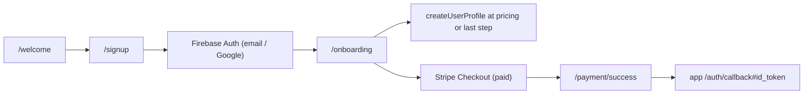
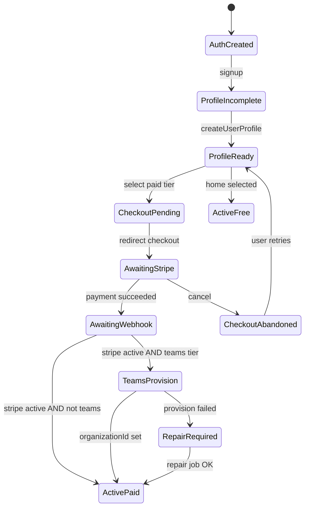
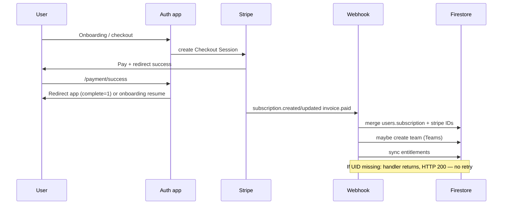
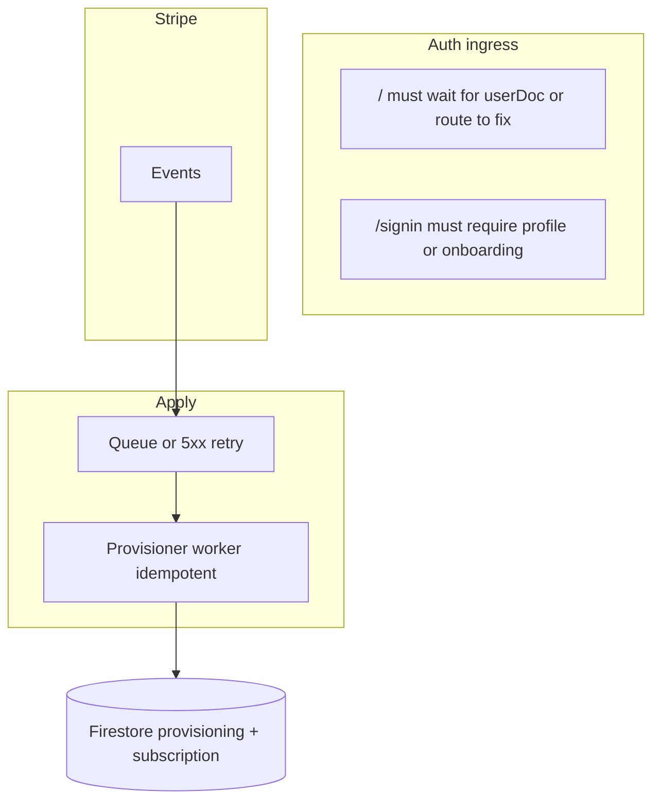

# Auth repo (`auth.groundzy`) — production reliability audit

**Scope:** `C:\Groundzy\auth` (Next.js auth app: Firebase Auth, Firestore, Stripe Checkout + webhooks, onboarding, teams/invites).  
**Date:** 2026-05-15  
**Goal:** Explain how signup / billing / provisioning work, where state can break, and what to harden for intermittent “incomplete or broken” accounts.

**Related in-repo docs:** `auth/docs/SIGNUP_FLOW.md` (high-level flow; some details differ from code—see §4).  
**Cross-repo:** `docs/app/auth.md` describes **app** routes (`auth/callback`, etc.); this audit focuses on the **auth** service.

---

## 1. Executive summary

The auth app implements a **client-driven onboarding state machine** (React `step` + `profileCreatedRef`) backed by **Firestore `users/{uid}`** and **Stripe webhooks** for subscription truth. Paid access is inferred from **`subscription.tier` + `subscription.status`** (`lib/tier-utils.ts`).

**Top reliability themes:**

| Theme | Severity | Notes |
|--------|----------|--------|
| **Auth user without Firestore profile** | High | Several paths redirect to the **app with `id_token`** without proving `users/{uid}` exists (`/`, `/signin`, `/complete-payment` when `userDoc` is null). |
| **Teams provisioning depends on webhook + prior writes** | High | If `pendingTeamCreation` / `organizationData` is missing or malformed, **`maybeProvisionTeamForWebhook` no-ops** (warn log only); checkout can succeed while **`organizationId` stays empty**. |
| **Stripe ↔ Firestore async lag** | Medium | Users can hit the app **before** `subscription.updated` / `invoice.paid` lands; UX depends on realtime `userDoc` listener catching up. |
| **Webhook handler partial failure** | Medium | **`createTeamForWebhook` errors are swallowed** inside `maybeProvisionTeamForWebhook` (subscription fields may still update). Stripe returns **500** only if an exception escapes the outer `try`; inner team errors do **not** fail the HTTP response → **Stripe will not retry** for that failure mode. |
| **Username reservation race** | Medium | **`createUserProfile` is not transactional** across `usernames/{low}` + `users/{uid}` → rare duplicate / stolen handle under concurrency. |
| **Tier string multiplicity** | Low–Med | Canonical runtime tiers (`Small Team`, `Plus`, …) coexist with legacy **`Teams`** (`joinTeam`, repair API); mitigated partly by **`normalizeTier`** and `scripts/reconcile-subscription-tiers.ts`. |
| **`subscription.created` vs `updated` ordering** | Addressed | Prior bug (full replace of `subscription` map) was fixed via **dot-notation updates** + **omit `status` when `incomplete`** (see `.cursor/plans/fix_subscription_webhook_race_56b4d844.plan.md`). |

Many “broken” reports in production will be explained by **(a)** users abandoning checkout or onboarding, **(b)** **Firestore missing** despite Firebase Auth existing, **(c)** **Teams webhook not creating org**, or **(d)** **client assuming `userDoc` is loaded** when it is still `null` briefly or failed.

---

## 2. Architecture & stack assumptions

- **Hosting:** Next.js App Router (`app/`), server actions (`app/actions/*`), API routes (`app/api/*`).
- **Identity:** Firebase Auth (email/password, Google popup). **No anonymous `linkWithCredential` flow** in `lib/firebase/auth.ts` — “anonymous → registered” is **not** implemented here.
- **Database:** Firestore; server uses **Firebase Admin** (`lib/firebase/admin.ts`); client uses SDK (`lib/firebase/firestore.ts`).
- **Billing:** Stripe **Checkout** `mode: subscription` (`app/api/stripe/create-checkout-session/route.ts`). Webhooks: `customer.subscription.{created,updated,deleted}`, `invoice.paid` (`app/api/stripe/webhook/route.ts`).
- **Entitlements:** Denormalized `users/{uid}.entitlements` recalculated from tier + status (`lib/entitlements/sync-user.ts`) after webhook paths.
- **App handoff:** `buildRedirectWithToken` (`lib/return-url.ts`) sends users to **app** with `#id_token=...` (fragment), not a server session cookie on the auth host.

**Implicit assumptions (dangerous if violated):**

1. **App** correctly exchanges `#id_token` and then loads **`users/{uid}`** with its own rules.
2. **Every signed-in user has a `users` document** before using the app — **not enforced** on auth service boundaries.
3. **Stripe Price IDs** are fully mapped in `@groundzy/pricing` → `getTierFromPriceId` — unknown IDs → **`null` tier** in webhooks (logged, not defaulted).
4. **Teams** self-serve is gated by `TEAMS_SELF_SERVE_CHECKOUT_ENABLED` (`create-checkout-session`, onboarding UI).

---

## 3. Source of truth model (current vs recommended)

### 3.1 Current (de facto)

| Concern | Source of truth | Consumers |
|---------|------------------|-----------|
| Identity | Firebase Auth | All |
| Profile / onboarding fields | Firestore `users/{uid}` | Auth app + app |
| Subscription **money truth** | Stripe Subscription + Invoices | Webhooks |
| Subscription **projection** | Firestore `users.{subscription, stripe*}` | Auth routing, entitlements, app gates |
| Team membership | Firestore `teams/{id}`, `users.organizationId` | App |
| Username | `usernames/{lowercase}` + `users.username` | Profile |

**Problem:** There is **no single persisted “onboarding / provisioning state” field** (e.g. `provisioningStatus`); instead, the system **infers** completeness from **tier**, **status**, presence of **`organizationId`**, **`initialMapLocation`**, etc. That inference is **spread across client steps and a few redirects**.

### 3.2 Recommended

1. **Stripe** remains financial source of truth.
2. **Firestore** holds a **explicit state machine** on `users/{uid}`:
   - `provisioning.status`: `needs_profile | needs_checkout | awaiting_webhook | needs_team_repair | active | failed`
   - `provisioning.lastError` / `provisioning.updatedAt`
3. **Webhooks** transition this state **idempotently** (not only “patch subscription map”).
4. **App + auth** route on `provisioning.status`, not on ad-hoc `userDoc` null checks.

---

## 4. End-to-end flows (as implemented)

### 4.1 Signup → onboarding (happy path)

- `/signup` uses `AuthSlide` with **`requireOnboarding`** → always **`/onboarding`** with query params (invite / returnUrl).
- **Not** the behavior described in an older reading of `AuthSlide` without `requireOnboarding` (direct-to-app with `returnUrl` only) — **signup forces onboarding**.

### 4.2 Paid tier geometry (important)

For **Plus / Pro / Teams** (not Home free):

1. User reaches **pricing step (4)** → **`createUserProfile`** runs once (`profileCreatedRef`) with `subscription.status: "incomplete"` for non-`home` tier (`app/actions/auth.ts`).
2. User continues to **address (5)**, **units (6)**, then **checkout** is triggered from **units step** (`redirectToStripeCheckout`).
3. So **map + preferences are saved before payment** for current geometry — **good** for `redirectToApp` short-circuit (below).

**Enterprise:** contact flow from units step (`mailto:`) still expects profile created at pricing step if they passed pricing with enterprise selected.

### 4.3 Payment success: two behaviors

`app/payment/success/page.tsx`:

- If **`complete=1`**: treat onboarding as done → **retry `getIdToken`** → redirect to **app callback** with token (no return to onboarding).
- Else: redirect to **`/onboarding?resume=after-payment`**.

Checkout session creation sets `complete=1` when body includes **`redirectToApp: true`** (`create-checkout-session`). Onboarding always passes **`redirectToApp: true`** for paid checkout — so **post-payment map step is skipped for the main flow** (by design, because map already happened earlier).

**Edge case:** Any **legacy** or **manual** checkout session without `redirectToApp` still uses **`resume=after-payment`**.

### 4.4 Root `/` (authenticated launcher)

`app/page.tsx`:

- Unauthed → `/welcome`.
- If **`userDoc` exists** and `hasPaidTierIncomplete` → `/complete-payment`.
- Else → **`getIdToken(true)`** then **`window.location.href = buildRedirectWithToken(returnUrl, token)`**.

**Gap:** If **`user` exists but `userDoc` is still `null`** (loading race, missing doc, or `getUser` error), the code **does not** wait for `userDoc` and **does not** send the user to onboarding; it **redirects to the app**. Same pattern if **`userDoc` never exists** — user can land in app **without a profile**.

### 4.5 Sign-in

`app/signin/page.tsx` — after login, **immediate** redirect to **`returnUrl` or app callback** with token. **No Firestore existence check**, no incomplete-subscription check on this page.

### 4.6 Complete payment

`complete-payment/_components/complete-payment-content.tsx`:

- No user → welcome.
- **No `userDoc`** → redirect to app with token (**same risk as `/`**).
- Not incomplete → app.
- Teams incomplete → `/onboarding?resume=teams`.
- Plus/Pro → inline checkout UI.

### 4.7 Stripe webhook

Handlers in `lib/stripe-webhook-handlers.ts`:

- Resolve Firebase UID: `subscription.metadata.firebaseUserId` or **customer metadata** fallback.
- **`handleSubscriptionCreated`:** dot-path updates; **skips writing `subscription.status` when Stripe status is `incomplete`**; may call **`maybeProvisionTeamForPaidSubscription`** when tier is a Teams runtime tier and status is `active` or `trialing`.
- **`handleSubscriptionUpdate` / `handleInvoicePaid`:** `syncSubscriptionStateFromStripeObject` (full status write, Teams provisioning retry path).
- **`handleSubscriptionCancelled`:** sets `subscription.status` to `cancelled` (tier unchanged).

### 4.8 Teams creation

- Before checkout: API may set **`pendingTeamCreation`** (`create-checkout-session`) when `organizationData` + `teamSizeRaw` present; onboarding also writes **`organizationData`** via client `updateUserOrganizationData` before address → **webhook fallback**.
- Webhook: **`createTeamForWebhook`** (`app/actions/team.ts`) creates `teams` doc, sets user `organizationId`, `role: owner`, invite code, then webhook updates team with `subscriptionId` / period end.
- **Repair:** `POST /api/teams/repair` for users with **legacy tier string `Teams`/`teams`**, no `organizationId`, and org data present.

### 4.9 Invite / join

- Validate: `app/api/invite-code/validate/route.ts` (not fully re-audited here; flows into `/signup?inviteCode=...`).
- Onboarding **join path:** `createUserProfile(..., "teams")` then **`joinTeam`** (transaction on team + user + invite usage). Jumps to **map step**.

---

## 5. Tier / plan assignment & Stripe mapping

### 5.1 At profile creation

`createUserProfile` maps **request tier** → Firestore `subscription.tier` string:

- `home` → `Home`, `plus` → `Plus`, `pro` → `Pro`, `enterprise` → `Enterprise`, **`teams` → `Small Team`** (default bucket until webhook refines).

**Status:** `incomplete` for any non-`home` tier at creation.

### 5.2 At webhook (authoritative for paid line item)

`resolveFirestoreTierFromSubscription` → **`getTierFromPriceId(priceId)`** (`lib/stripe-webhook-tier.ts` → `@groundzy/pricing`).

`packages/pricing/src/stripe-tier-map.ts`:

- Hard-coded **Pro / Small / Mid / Large Team** price IDs.
- **Plus** via default IDs + env `STRIPE_PRICE_PLUS_*`.

**Checkout** uses `getStripeCheckoutPriceId` / env alignment (`lib/stripe-checkout-prices.ts`). If env checkout price **≠** mapped IDs, tier resolution returns **`null`** → webhook logs **`unknown price id`**; user may keep **profile-time tier** until fixed.

### 5.3 Effective access

`getEffectiveSubscriptionTier`: **Home** always; paid tiers only if status ∈ **`active` | `trialing`**. Otherwise treated as **Home** for gating (`lib/tier-utils.ts`).

### 5.4 Legacy / normalization

- `joinTeam` sets **`subscription.tier: "Teams"`** (string). Client-side **`normalizeTier`** maps **`Teams` → `Small Team`** for many checks — raw Firestore may still say `Teams`.
- `scripts/reconcile-subscription-tiers.ts` can rewrite non-canonical tiers using **Stripe** or **team doc** hints.

---

## 6. Failure points (inventory)

### 6.1 Client / routing

1. **`/` and `/signin` and `/complete-payment` with `userDoc === null`** → redirect to app **anyway** (after auth).
2. **Onboarding** does not **gate the page** on `user` presence — only **toasts** on continue if signed out (`getCurrentUser()`).
3. **`profileCreatedRef` is memory-only** — refresh mid-onboarding can **double-invoke** `createUserProfile` (second call fails username taken → user stuck unless they pick a new username).
4. **Resume params** (`resume=after-payment`, `resume=teams`, `resume=pricing`) depend on **query + `userDoc`**; Race: **`after-payment` sets step from `userDoc` tier** — if webhook not fired yet, **wrong step index** possible.
5. **Payment success `complete=1`**: If session completes but **`getIdToken` fails** after retries → **`/signin?returnUrl=appCallback`** — reasonable recovery, but user may not understand why.

### 6.2 `createUserProfile` (`app/actions/auth.ts`)

6. **Admin not configured** → clear error (local dev friction).
7. **Token expiry** → “Invalid or expired session”.
8. **Username taken** → hard stop (expected).
9. **Non-atomic username + user write** → rare inconsistency under concurrency (§7).
10. **`userRef.set` overwrites** whole doc on first create — **must not be called twice** for same uid (guarded client-side only).

### 6.3 Stripe checkout (`create-checkout-session`)

11. **User 404** if Firestore doc missing.
12. **Teams checkout paused** (`403 teams_checkout_paused`) unless exception for incomplete Teams repair path.
13. **Missing price env** → 503.
14. **`pendingTeamCreation` conditional on `teamSizeRaw` truthy** — if caller omits team size key, **`pendingTeamCreation` might not be written**; mitigation: **`organizationData` on user** from onboarding.

### 6.4 Webhooks

15. **`resolveFirebaseUserIdFromSubscription` fails** → handler returns early → **Firestore never updated** (Stripe retries only on **HTTP 5xx** from route — early `return` is **200-less** actually: `handleSubscriptionCreated` returns `undefined` — route still **`return NextResponse.json({ received: true })`** → Stripe treats as success → **no retry**).

    **Correction:** Inspect `route.ts` — handlers are `await handleSubscriptionCreated`; if inner function **`return`** early due to missing userId, **no throw** → **HTTP 200** → **Stripe will NOT retry**.

16. **`userRef.update` on missing user doc** → throws → outer catch → **500** → Stripe retries (good).

17. **Unknown price ID** → tier not updated (logged).

18. **Teams provisioning** missing data → warn + skip; **`createTeamForWebhook` catch** → log only; **`syncEntitlementsForUser` still runs** with possibly wrong org/tier mix.

19. **Webhook not configured** (`503`) — events may queue in Stripe dashboard for manual replay.

### 6.5 Teams / org

20. Paid **Teams** without **`organizationId`** — user shows as paid tier incomplete or **effective Home** depending on status; **`/api/teams/repair`** exists but **is not linked in normal UX**.
21. **`createTeamForWebhook` + `teams` doc update** are not **atomic** — possible partial team doc if second update fails (rare).

### 6.6 Join / invite

22. **`joinTeam` fails** after **`createUserProfile` succeeded** → user has **profile + Small Team tier** intent but not in team — needs support or re-run join.
23. **Invite limits / expiry** — user errors surfaced as thrown messages in onboarding.

---

## 7. Race conditions & async timing

1. **Webhook vs client redirect:** User completes Checkout → **`complete=1` → app** while **`subscription.updated` still in flight** → brief **incorrect tier** until snapshot updates (or forever if webhook failed).
2. **`subscription.created` after `updated`:** Mitigated by **not clobbering status** when `incomplete` (plan referenced above).
3. **`invoice.paid` vs `subscription.updated`:** Both call `syncSubscriptionStateFromStripeObject` — eventual consistency OK if Stripe data consistent.
4. **Firestore listener vs redirect:** `useAuth` sets `userDoc` from snapshot — root `/` may run effect **before** first snapshot arrives → **premature app redirect** (see §6.1 item 1).
5. **`resume=after-payment` without `userDoc`:** Code sets step using **`userDoc ? getUserSubscriptionTier(userDoc) : null`** → defaults to **non-Teams map step** if `userDoc` missing — wrong for **Teams** if webhook lagging.

---

## 8. OAuth vs email/password

- **Same** post-auth routing for signup (both go through **`/onboarding`** with `requireOnboarding` on `/signup`).
- **Google popup** failures (closed popup) surfaced via toast.
- **Account linking** (`account-exists-with-different-credential`) — message exists; no **automatic credential linking** flow visible in `auth-slide` / `signin`.

---

## 9. Session persistence (refresh / tab close)

- Firebase Auth **persistence** is default (browser local). Stripe redirect **returns to same site** — session usually restored.
- **`payment/success`** implements **token retry** for race after redirect — good.
- **Fragment token to app** is **one-shot** handoff; app must persist its own session.

---

## 10. Firestore transactional integrity

| Operation | Transaction? | Risk |
|-----------|----------------|------|
| `createUserProfile` | No | Username / user skew |
| `joinTeam` | Yes | Strong |
| Webhook user update + team create | No cross-doc tx | Partial failures possible |
| `pendingTeamCreation` delete | FieldValue.delete in user update | OK if team create succeeded |

---

## 11. Canceled / incomplete payments

- **Checkout cancel URL** returns user to **`/complete-payment`** or **`/onboarding`** depending on `returnTo` / tier (`create-checkout-session`).
- **Incomplete subscription** in Stripe: **`handleSubscriptionCreated` does not write `subscription.status` for `incomplete`** — Firestore may still show **`incomplete`** from profile creation — user should hit **`/complete-payment`** when visiting `/` if snapshot loaded.

---

## 12. Duplicate account possibilities

- **Different providers** for same email → Firebase rules + linking UX.
- **Duplicate Stripe customers** possible when using **`customer_email` without reusing `stripeCustomerId`** — operational debt, not a direct auth bug.
- **Duplicate team creation** guarded by **`organizationId`** check in **`maybeProvisionTeamForWebhook`** — if cleared incorrectly, could double-create (low probability).

---

## 13. Error handling & logging coverage

- **Webhooks:** `console.error` / `console.warn` — **no structured correlation id** (Stripe `event.id`), no dead-letter queue in code.
- **`createUserProfile`:** JSON-stringified logs with reason codes — good for grep.
- **Client:** toasts + some **console.log** for redirects (may leak token **length** only in dev-oriented logs — still trim in production).

**Security footnote (repo hygiene):** A path like `groundzy-v2-firebase-adminsdk-*.json` appeared in a workspace file listing — **service account JSON must not live in the repo**. Treat as **incident** if committed; rotate keys.

---

## 14. Root-cause hypotheses (for “broken / incomplete” accounts)

1. **Abandonment:** Checkout or onboarding closed mid-flow — Firestore shows **`incomplete`** paid tier or partial profile.
2. **Auth without profile:** User signed in from **another device** or **`/signin`** after partial signup — **app allows** or fails depending on app logic.
3. **Webhook success but missing UID metadata:** Early `return` in webhook → **200 OK** → **no Stripe retry** → subscription in Stripe **not mirrored** to Firestore.
4. **Unknown price ID** after price rotation — tier not updated.
5. **Teams org not created** — missing `pendingTeamCreation` / `organizationData` or **silent error** in `createTeamForWebhook`.
6. **Race: Firestore `userDoc` null on `/`** — sent to app without **incomplete payment** redirect.
7. **Refresh during onboarding** — ref state lost; **username conflict** on second `createUserProfile`.

---

## 15. Risk assessment

| Area | Likelihood | Impact | Notes |
|------|------------|--------|--------|
| Missing Firestore doc + app access | Med | High | `/`, `/signin`, `/complete-payment` |
| Webhook no-op + HTTP 200 | Low–Med | High | Missing `firebaseUserId` |
| Teams without org | Med | High | Silent skip / swallowed error |
| Webhook delay | High | Med | UX confusion, not permanent if events succeed |
| Username TOCTOU | Low | Med | Support / rename |
| Unknown Stripe price | Low | Med | After pricing changes |

---

## 16. Recovery strategy (today)

1. **Stripe Dashboard:** Replay events / verify subscription exists and metadata **`firebaseUserId`**.
2. **Firestore:** Inspect `users/{uid}` — `subscription`, `stripeCustomerId`, `pendingTeamCreation`, `organizationData`, `organizationId`.
3. **Scripts:** `npx tsx scripts/reconcile-subscription-tiers.ts` for tier strings.
4. **API:** `POST /api/teams/repair` with user Bearer token for **Teams + no org** cases (when org data present).
5. **User-driven:** `/complete-payment` downgrade to Home (`/api/user/subscription/downgrade-incomplete-to-home`) for **non-Teams** incomplete.

**Gap:** No **scheduled** reconciler that compares **Stripe ↔ Firestore** for every active subscriber.

---

## 17. Recommended fixes (priority order)

### P0 — Correctness / safety

1. **Never send users to the app without a loaded `userDoc` or an explicit “missing profile” route** on `/`, `/signin`, `/complete-payment` — block until snapshot loads **or** redirect to **`/onboarding`** / **`/welcome`** with message.
2. **Webhook: return non-2xx or enqueue retry** when **`userId` cannot be resolved** or **`userRef.update` is skipped** for subscription events (or push to a **DLQ** / Cloud Task).
3. **Teams provisioning:** On `createTeamForWebhook` failure, **surface** `provisioning.failed` / **alerting**; consider **Stripe → internal queue** for team creation idempotency.
4. **Transactional username claim** using Firestore transaction (read `usernames`, write `usernames` + `users` together).

### P1 — Resilience

5. **Idempotent profile creation:** Server action **`createUserProfileIfMissing`** merges instead of blind `set` for same UID; handles refresh safely.
6. **Persist onboarding step** in Firestore (`onboarding.step`) for resume across devices (optional but high UX win).
7. **Scheduled reconciliation job:** Nightly **`stripeSubscriptionId`** fetch + compare tier/status vs Firestore; auto-fix or alert.

### P2 — UX / clarity

8. **Explain “payment processing”** on app landing when `stripeSubscriptionId` set but status not active yet (webhook lag).
9. **Surface `/api/teams/repair`** in UX when **Teams paid + no `organizationId`** (button “Fix my organization”).
10. **Align `SIGNUP_FLOW.md`** with **`requireOnboarding` on `/signup`** and **`redirectToApp` / `complete=1`** behavior.

---

## 18. Monitoring & logging to add

- **Structured logs:** `stripeEventId`, `stripeCustomerId`, `subscriptionId`, `firebaseUid`, outcome, latency.
- **Metrics:** webhook success rate, **skipped handler count**, **Teams provision failures**, **`unknown price id` count**, **`user doc missing` count** on webhook.
- **Alerts:** Spike in **`hasPaidTierIncomplete`** users with **Stripe active** (query support views / BigQuery export).
- **Traces:** Checkout creation → webhook → Firestore write **correlation via `checkout.session`** id stored on user doc at session creation (currently not stored).

---

## 19. Analytics / funnel events (recommended)

Existing (`lib/firebase/analytics.ts`): `signup_credentials_complete`, `onboarding_step_view`, `create_user_profile_result`.

**Add:**

- `checkout_session_created` `{ tier, billing, teams_size }`
- `checkout_completed` `{ session_id }` (server or client on success page)
- `webhook_subscription_sync` (server-side only if piped to GA4 Measurement Protocol — or use BigQuery export from Stripe/Firestore)
- `app_handoff_blocked_no_user_doc`
- `teams_repair_invoked` / outcome
- `payment_success_token_retry_exhausted`

---

## 20. Ideal provisioning state machine

**Transitions should be:**

- **Persisted** on `users/{uid}` (not only UI).
- **Driven by** Stripe webhooks **and** idempotent workers.

---

## 21. Production hardening checklist

- [ ] Verify **all** Checkout prices exist in `getTierFromPriceId` **in the deployed env**.
- [ ] Stripe webhook **signing secret** rotated on schedule; **no 200** on “could not apply event”.
- [ ] **Metadata:** `firebaseUserId` on **subscription** always set (checkout already does — verify Dashboard-created subs).
- [ ] **`/` redirect** waits for **`userDoc` load or timeout** → safe fallback route.
- [ ] **`/signin`** checks **`users` exists**; if missing → onboarding.
- [ ] **`createTeamForWebhook` failures** page on-call **Slack/email**.
- [ ] Remove **service account JSON** from repo; use **Workload Identity / Secret Manager**.
- [ ] Load test: webhook burst + concurrent signups (**username tx** validated).
- [ ] Run **`reconcile-subscription-tiers`** after **any** Stripe price migration.

---

## 22. Refactor plan (phased)

**Phase A — Routing safety (1–2 days)**  
Gate app redirect on **`userDoc` loaded** + **`!hasPaidTierIncomplete` unless app handles** + **profile exists**.

**Phase B — Webhook reliability (2–5 days)**  
Structured logging; **fail HTTP** when event not applied; optional **Pub/Sub** fan-out.

**Phase C — Provisioning entity (1–2 weeks)**  
Persist `provisioning.status`; nightly **Stripe reconcile** worker.

**Phase D — UX**  
Resume onboarding cross-device; in-product **repair** for Teams.

---

## 23. Diagram: current webhook + client (condensed)

---

## 24. Diagram: recommended control flow

---

## 25. Verification notes (against `auth/docs/SIGNUP_FLOW.md`)

Update the internal doc for:

1. **`/signup` always `requireOnboarding`** — AuthSlide cannot bypass onboarding for **`returnUrl`** on the signup page.
2. **`redirectToApp` + `complete=1`** — default paid path skips **`resume=after-payment`** because onboarding completes **before** payment in step order.

---

## 26. Appendix — key file map

| File | Role |
|------|------|
| `app/onboarding/page.tsx` | Step machine, checkout, profile, join |
| `app/actions/auth.ts` | `createUserProfile` |
| `app/actions/team.ts` | `joinTeam`, `createTeamForWebhook` |
| `app/api/stripe/create-checkout-session/route.ts` | Checkout + `pendingTeamCreation` |
| `app/api/stripe/webhook/route.ts` | Webhook ingress |
| `lib/stripe-webhook-handlers.ts` | Subscription + invoice logic |
| `lib/tier-utils.ts` | Incomplete / effective tier |
| `app/page.tsx` | Post-auth routing risk |
| `app/signin/page.tsx` | No profile check |
| `app/payment/success/page.tsx` | `complete=1` vs onboarding resume |
| `app/complete-payment/_components/complete-payment-content.tsx` | Incomplete paid handling |
| `packages/pricing/src/stripe-tier-map.ts` | Price → tier |
| `scripts/reconcile-subscription-tiers.ts` | Tier reconciliation |

---

*End of audit.*
