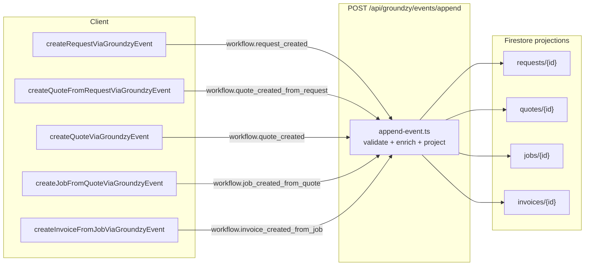

# Workflow audit: Request → Quote → Job → Invoice

**Scope:** How business data and identifiers flow through the sales / operations pipeline, including **Groundzy v3 event append** paths and **legacy Firestore** paths that still run in parallel.  
**App repository:** sibling `app` (paths below are `app/...` from monorepo root).  
**Audit date:** 2026-04-20.

---

## 1. Executive summary

The pipeline is implemented as **four Zod-defined workflow payloads**, transactional **append + projection** on the server, and **thin client mappers** that POST to `/api/groundzy/events/append`. Downstream documents are linked by **foreign keys** (`requestId` on quote, `quoteId` on job, `jobId` on invoice) plus **backlinks** on the upstream doc (`convertedToQuoteId`, `convertedToJobId`, `primaryInvoiceId`). **Server-side enrich** functions fill gaps (empty line items, totals, `requestId` on job from quote, `quoteId` on invoice from job) using the **current Firestore projection** of the parent entity read inside the append transaction.

**Important:** The UI hooks still expose **legacy batch writes** for some branches (`convertRequestToJob`, `convertJobToInvoice`, direct `createJob`), while the “happy path” for quote→job and job drawer→invoice uses **v3 events**. Those stacks duplicate logic (line-item mapping) and can **diverge** (e.g. initial job status rules).

---

## 2. End-to-end diagram (canonical v3 path)



**Correlation id (event chain):**

| Step | Default `correlationId` on append (client) |
|------|---------------------------------------------|
| Request | `requestId` (same as new request id) — `app/lib/groundzy/client/create-request-via-event.ts` |
| Quote from request | `requestId` |
| Standalone quote | new UUID in `createQuoteViaGroundzyEvent` |
| Job from quote | `data.requestId ?? quoteId` |
| Invoice from job | `job.correlationId ?? job.requestId ?? job.quoteId ?? job.id` |

---

## 3. Truth source: event types and schemas

All payload shapes are **`strict()` Zod objects** in:

`app/lib/groundzy/events/schema/workflow.ts`

| Event `type` | Purpose |
|--------------|---------|
| `workflow.request_created` | Creates `requests/{requestId}` |
| `workflow.quote_created_from_request` | Creates `quotes/{quoteId}` + patches request |
| `workflow.quote_created` | Creates quote **without** a request |
| `workflow.job_created_from_quote` | Creates `jobs/{jobId}` + patches quote |
| `workflow.invoice_created_from_job` | Creates `invoices/{invoiceId}` + patches job |

Representative excerpts:

```47:73:app/lib/groundzy/events/schema/workflow.ts
export const workflowRequestCreatedPayloadSchema = z
  .object({
    requestId: z.string().min(8).max(128),
    organizationId: z.string().min(1),
    clientId: z.string().min(1),
    contactId: z.string().optional(),
    propertyId: z.string().optional(),
    title: z.string().min(1).max(500),
    // ... serviceDetails, requestItems, schedule fields, assignedToUserIds ...
  })
  .strict();
```

```108:129:app/lib/groundzy/events/schema/workflow.ts
export const workflowQuoteCreatedFromRequestPayloadSchema = z
  .object({
    quoteId: z.string().min(8).max(128),
    requestId: z.string().min(8).max(128),
    organizationId: z.string().min(1),
    clientId: z.string().min(1),
    propertyId: z.string().min(1),
    title: z.string().min(1).max(500),
    lineItems: z.array(quoteLineItemSchema),
    // ... totals, validUntilMs ...
  })
  .strict();
```

```186:205:app/lib/groundzy/events/schema/workflow.ts
export const workflowJobCreatedFromQuotePayloadSchema = z
  .object({
    jobId: z.string().min(8).max(128),
    quoteId: z.string().min(8).max(128),
    organizationId: z.string().min(1),
    propertyId: z.string().min(1),
    schedule: jobScheduleMsSchema,
    pricing: z.any().optional(),
    treeIds: z.array(z.string()).optional(),
    /** Optional client hint; canonical `requestId` on job comes from quote in enrich. */
    requestId: z.string().optional(),
    // ...
  })
  .strict();
```

```231:261:app/lib/groundzy/events/schema/workflow.ts
export const workflowInvoiceCreatedFromJobPayloadSchema = z
  .object({
    invoiceId: z.string().min(8).max(128),
    jobId: z.string().min(8).max(128),
    organizationId: z.string().min(1),
    clientId: z.string().min(1),
    lineItems: z.array(invoiceLineItemSchema),
    quoteId: z.string().optional(),
    workItemIds: z.array(z.string()).optional(),
    jobStatusBeforeInvoice: z.enum([/* ... */]).optional(),
    // ...
  })
  .strict();
```

---

## 4. Truth source: server append — validation, enrich, conflicts

`app/lib/groundzy/server/append-event.ts` runs in a transaction. For each conversion event it loads the **parent** document, checks **org** and **idempotency / single-conversion** rules, then assigns `resolvedPayload` from the enrich helpers.

**Quote from request** (request must exist, not already converted):

```243:266:app/lib/groundzy/server/append-event.ts
    } else if (command.type === "workflow.quote_created_from_request") {
      const q = command.payload;
      const reqRef = adminDb.collection("requests").doc(q.requestId);
      const reqSnap = await tx.get(reqRef);
      if (!reqSnap.exists) {
        throw new AppendPolicyError("Request not found", "BAD_REQUEST");
      }
      const reqData = { id: reqSnap.id, ...reqSnap.data() } as Request;
      if (reqData.organizationId !== command.organizationId) {
        throw new AppendPolicyError(
          "Request does not belong to this organization",
          "BAD_ORG"
        );
      }
      if (reqData.convertedToQuoteId) {
        throw new AppendPolicyError(
          "Request already converted to quote",
          "CONFLICT"
        );
      }
      resolvedPayload = enrichQuoteCreatedFromRequestPayload(
        reqData,
        q
      ) as unknown as Record<string, unknown>;
```

It also attaches **`linkedRequestAssigneeUserIds`** for a **post-projection side effect** (tree access grant), not for the quote projection itself:

```283:289:app/lib/groundzy/server/append-event.ts
      const requestAssignees = Array.isArray(reqData.assignedToUserIds)
        ? reqData.assignedToUserIds
        : [];
      resolvedPayload = {
        ...resolvedPayload,
        linkedRequestAssigneeUserIds: requestAssignees,
      };
```

**Job from quote** and **invoice from job** follow the same pattern (quote/job must exist, org match, quote not already converted, job must not already have `primaryInvoiceId`, invoice `clientId` must match job).

---

## 5. Truth source: enrich functions (computed fields)

| Enrich | File | Role |
|--------|------|------|
| Request → quote line items / totals | `app/lib/groundzy/server/enrich-quote-from-request-payload.ts` | If line items empty, build from `requestItems` (+ `serviceDetails` fallback); recompute subtotal/tax/total when omitted |
| Quote → job pricing / `requestId` / `treeIds` | `app/lib/groundzy/server/enrich-job-from-quote-payload.ts` | If `pricing.lineItems` empty, copy from `quote.lineItems`; set `requestId` from `quote.requestId ?? payload.requestId` |
| Job → invoice lines / `quoteId` / work items | `app/lib/groundzy/server/enrich-invoice-from-job-payload.ts` | If invoice `lineItems` empty, copy from `job.pricing.lineItems`; set `quoteId` from `job.quoteId ?? payload.quoteId`; build `workItemIds`; snapshot `jobStatusBeforeInvoice` |

```12:35:app/lib/groundzy/server/enrich-quote-from-request-payload.ts
export function enrichQuoteCreatedFromRequestPayload(
  requestData: Request | undefined,
  payload: WorkflowQuoteCreatedFromRequestPayload
): WorkflowQuoteCreatedFromRequestPayload {
  let lineItems = payload.lineItems.filter((i) => (i.name ?? i.description)?.trim());
  if (lineItems.length === 0 && requestData?.requestItems?.length) {
    lineItems = requestItemsToQuoteLineItems(
      requestItemsWithServiceDetailsFallback(
        requestData.requestItems,
        requestData.serviceDetails
      )
    );
  }
  const subtotal = lineItems.reduce((s, i) => s + (i.total ?? 0), 0);
  // ...
}
```

```13:36:app/lib/groundzy/server/enrich-job-from-quote-payload.ts
export function enrichJobCreatedFromQuotePayload(
  quote: Quote,
  payload: WorkflowJobCreatedFromQuotePayload
): WorkflowJobCreatedFromQuotePayload {
  let pricing = payload.pricing as Job["pricing"] | undefined;
  let treeIds = payload.treeIds;
  if (!pricing?.lineItems?.length && quote.lineItems?.length) {
    const lineItems = quoteLineItemsToJobLineItems(quote.lineItems);
    treeIds = treeIds ?? extractTreeIdsFromLineItems(lineItems);
    // ...
  }
  return {
    ...payload,
    pricing,
    treeIds,
    requestId: quote.requestId ?? payload.requestId,
  };
}
```

```9:40:app/lib/groundzy/server/enrich-invoice-from-job-payload.ts
export function enrichInvoiceCreatedFromJobPayload(
  job: Job,
  payload: WorkflowInvoiceCreatedFromJobPayload
): WorkflowInvoiceCreatedFromJobPayload {
  let lineItems = payload.lineItems;
  let filledFromJob = false;
  if (!lineItems?.length && job.pricing?.lineItems?.length) {
    lineItems = jobLineItemsToInvoiceLineItems(job.pricing.lineItems);
    filledFromJob = true;
  }
  // subtotal rules, quoteId, workItemIds, jobStatusBeforeInvoice ...
}
```

**Shared mappers** (single place for cross-shape rules):

`app/lib/workflow/line-item-mappers.ts` — `requestItemsToQuoteLineItems`, `quoteLineItemsToJobLineItems`, `jobLineItemsToInvoiceLineItems`, `requestItemsWithServiceDetailsFallback`, `extractTreeIdsFromLineItems`.

---

## 6. Truth source: projection handlers (what gets written)

| Handler | File | Writes |
|---------|------|--------|
| Request created | `app/lib/groundzy/projections/handlers/workflow/request-created.ts` | `requests/{requestId}` (full set) |
| Quote from request | `app/lib/groundzy/projections/handlers/workflow/quote-from-request.ts` | `quotes/{quoteId}` **set**, `requests/{requestId}` **merge** (`convertedToQuoteId`, `status: "quoted"`) |
| Standalone quote | `app/lib/groundzy/projections/handlers/workflow/quote-created.ts` | `quotes/{quoteId}` only |
| Job from quote | `app/lib/groundzy/projections/handlers/workflow/job-from-quote.ts` | `jobs/{jobId}` **set**, `quotes/{quoteId}` **merge** (`convertedToJobId`, `status: "converted"`) |
| Invoice from job | `app/lib/groundzy/projections/handlers/workflow/invoice-from-job.ts` | `invoices/{invoiceId}` **set**, `jobs/{jobId}` **merge** (`primaryInvoiceId`, `invoicedAt`) |

Quote-from-request excerpt (note `requestId` on quote doc and backlinks):

```28:88:app/lib/groundzy/projections/handlers/workflow/quote-from-request.ts
  const quoteData: Record<string, unknown> = {
    organizationId: p.organizationId,
    clientId: p.clientId,
    propertyId: p.propertyId,
    quoteNumber,
    requestId: p.requestId,
    title: p.title,
    lineItems: p.lineItems,
    // ...
    sourceEventId: eventId,
    correlationId,
  };
  // ...
  const requestPatch: Record<string, unknown> = {
    convertedToQuoteId: p.quoteId,
    status: requestStatus,
    updatedAt: now,
    sourceEventId: eventId,
    correlationId,
  };
```

Job-from-quote excerpt (v3 job is created with **`status: "scheduled"`** always — see below):

```21:25:app/lib/groundzy/projections/handlers/workflow/job-from-quote.ts
  const p = payload as WorkflowJobCreatedFromQuotePayload;
  const now = Timestamp.fromMillis(createdAtMs);
  const jobStatus: JobStatus = "scheduled";
  const quoteStatus: QuoteStatus = "converted";
```

Invoice excerpt:

```27:74:app/lib/groundzy/projections/handlers/workflow/invoice-from-job.ts
  const invoiceData: Record<string, unknown> = {
    organizationId: p.organizationId,
    clientId: p.clientId,
    jobId: p.jobId,
    invoiceNumber,
    title: p.title,
    lineItems: p.lineItems,
    // ...
    sourceEventId: eventId,
    correlationId,
  };
  // ...
  const jobPatch: Record<string, unknown> = {
    primaryInvoiceId: p.invoiceId,
    invoicedAt: now,
    updatedAt: now,
    sourceEventId: eventId,
    correlationId,
  };
```

Orchestration: `app/lib/groundzy/projections/apply.ts` (`getProjectionEffectsForEvent`).

---

## 7. Truth source: client entry points and hooks

| Action | Client module | React Query hook |
|--------|---------------|------------------|
| Create request | `app/lib/groundzy/client/create-request-via-event.ts` | `app/hooks/useRequests.ts` → `createRequestViaGroundzyEvent` |
| Create quote (from request) | `app/lib/groundzy/client/create-quote-from-request-via-event.ts` | `app/hooks/useQuotes.ts` — branch when `requestId` passed |
| Create quote (standalone) | `app/lib/groundzy/client/create-quote-via-event.ts` | `useQuotes.ts` — else branch |
| Create job (from quote) | `app/lib/groundzy/client/create-job-from-quote-via-event.ts` | `app/hooks/useJobs.ts` — when `quoteId` passed |
| Create invoice (from job drawer) | `app/lib/groundzy/client/create-invoice-from-job-via-event.ts` | `app/hooks/useInvoices.ts` — `fromJobDrawer: true` |

**Quote form** prefills from drawer params and loads `useRequest(requestId)` when converting:

`app/drawers/quote-form.tsx` (params: `requestId`, `clientId`, `propertyId`, `treeId`; submit uses `{ data, requestId }` when `requestId` is set — grep `createQuote` / `useCreateQuote` in that file).

**Invoice form** passes `quoteId` from params or job:

`app/drawers/invoice-form.tsx` (`jobId`, `quoteId`; submit maps `quoteId: quoteId ?? jobForSubmit.quoteId`).

---

## 8. Field lineage (what copies where)

| Field / concept | Request | Quote | Job | Invoice |
|-----------------|---------|-------|-----|---------|
| `organizationId`, `clientId`, `contactId` | Payload | Payload | Payload | Payload |
| `propertyId` | Optional on request | **Required** on quote-from-request | Required on job | Not on doc; implied via `jobId` |
| Line items | `requestItems` / `serviceDetails` | `lineItems` | `pricing.lineItems` | `lineItems` |
| Tree linkage | `requestItems[].treeId` | `lineItems[].treeIds` | `treeIds` + pricing lines | `lineItems[].treeIds` |
| Upstream id | — | `requestId` | `quoteId`, `requestId` (from enrich) | `jobId`, `quoteId` (enrich) |
| Display sequence | `requestNumber` | `quoteNumber` | `jobNumber` | `invoiceNumber` |
| Workflow participants | `v3Workflow` on projection | same | same | same |
| `correlationId` on doc | Set in request projection | Set in quote projections | Set in job projection | Set in invoice projection |

**Note:** TypeScript interfaces in `app/types/request.ts`, `quote.ts`, and `invoice.ts` do **not** declare `correlationId` / `sourceEventId`, while `app/types/job.ts` does include them. Runtime documents still carry these fields from projections — **types are incomplete** relative to Firestore.

---

## 9. Parallel legacy stack (must stay in scope for upgrades)

These paths **do not** append Groundzy events for the same operation; they use `writeBatch` / direct client writes in `app/lib/firebase/firestore.ts`.

| Legacy API | Still used from |
|------------|-----------------|
| `convertRequestToJob` | `app/hooks/useJobs.ts` when `requestId` is set **without** `quoteId` |
| `convertQuoteToJob` | Deprecated for UI; exists for scripts/migration (comment in firestore.ts) |
| `convertJobToInvoice` | `app/hooks/useInvoices.ts` when **not** `fromJobDrawer` |
| `createJob` | `useJobs.ts` when neither `quoteId` nor `requestId` |

Behavioral differences worth tracking:

- **Job initial status:** v3 `job-from-quote` projection always sets `"scheduled"`. Legacy `convertRequestToJob` / `convertQuoteToJob` set `"scheduled"` only if `data.schedule?.startDate` exists, else `"unscheduled"` (`app/lib/firebase/firestore.ts` around lines 4173 and 4260).
- **Work items:** legacy `convertRequestToJob` sets `workItemIds` via `mirrorWorkItemIdsForNewDocument` (`app/lib/firebase/firestore.ts`). The v3 handler `app/lib/groundzy/projections/handlers/workflow/job-from-quote.ts` does **not** set `workItemIds` on the new job — only invoice enrich builds `workItemIds` for the invoice payload (`workItemIdsForNewInvoice`). **Gap:** v3-created jobs may lack `workItemIds` until some other writer adds them.
- **Events / intelligence:** legacy writes may **omit** `groundzy_events` and related participant indexing that v3 flows rely on.

---

## 10. Gaps, risks, and upgrade themes

1. **Dual implementation** of the same business rules (enrich vs `convert*` in `firestore.ts`). Consolidation target: **one** implementation (server-only) behind append, or shared pure functions called from both until legacy is removed.
2. **Job status semantics** differ between v3 projection and legacy conversion (scheduled vs unscheduled). Align with product rules and schedule validation.
3. **Request assignees → quote:** `linkedRequestAssigneeUserIds` drives **tree grant** payload only; the **quote document** does not store assignees (`Quote` type has no `assignedToUserIds`). If product expects carry-over, this is a functional gap.
4. **`processingFeeAmount`** exists on quotes (schema + projection) but **not** on the invoice workflow payload — fees may be **lost** at invoice time unless folded into line items manually.
5. **Type drift:** `correlationId` / `sourceEventId` missing from Request/Quote/Invoice TS types complicates invoice correlation fallback in `createInvoiceFromJobViaGroundzyEvent` (it expects them on `Job` only).
6. **Single invoice per job (v3):** append rejects if `job.primaryInvoiceId` already set; product may eventually need **multiple invoices** per job.
7. **Property on request:** optional on request but required when quoting — UI must always resolve property before append; consider server-side default from request if exactly one property on client (product decision).

---

## 11. Quick file index (copy/paste for PRs)

| Concern | Path |
|---------|------|
| Payload schemas | `app/lib/groundzy/events/schema/workflow.ts` |
| Append transaction + enrich | `app/lib/groundzy/server/append-event.ts` |
| Enrich quote / job / invoice | `app/lib/groundzy/server/enrich-quote-from-request-payload.ts`, `enrich-job-from-quote-payload.ts`, `enrich-invoice-from-job-payload.ts` |
| Line item mapping | `app/lib/workflow/line-item-mappers.ts` |
| Projections | `app/lib/groundzy/projections/handlers/workflow/request-created.ts`, `quote-from-request.ts`, `quote-created.ts`, `job-from-quote.ts`, `invoice-from-job.ts` |
| Client append wrappers | `app/lib/groundzy/client/create-request-via-event.ts`, `create-quote-from-request-via-event.ts`, `create-quote-via-event.ts`, `create-job-from-quote-via-event.ts`, `create-invoice-from-job-via-event.ts` |
| Hooks | `app/hooks/useRequests.ts`, `useQuotes.ts`, `useJobs.ts`, `useInvoices.ts` |
| Legacy converts | `app/lib/firebase/firestore.ts` (`convertRequestToJob`, `convertQuoteToJob`, `convertJobToInvoice`) |
| Domain types | `app/types/request.ts`, `quote.ts`, `job.ts`, `invoice.ts` |

---

## 12. Suggested upgrade sequence (engineering)

1. **Inventory UI call sites** for `useCreateJob` / `useCreateInvoice` / direct `createJob` and migrate remaining flows to v3 append where possible.  
2. **Extract shared “conversion” pure functions** used by both enrich and legacy (or delete legacy once traffic is zero).  
3. **Align `Job` creation status** with schedule payload across v3 and legacy.  
4. **Extend TypeScript models** to include persisted v3 metadata (`correlationId`, `sourceEventId`, optional `workItemIds` on quote if added).  
5. **Decide fee model** for invoice (line item vs header field) and reflect in `workflow.invoice_created_from_job` schema if needed.

---

## 13. Change checklist (engineering regression set)

Use this before merging workflow append / projection changes:

- **Event types touched:** list every `workflow.*` string added or modified; update [app/lib/groundzy/events/schema/system.ts](c:/Groundzy/app/lib/groundzy/events/schema/system.ts), [app/lib/groundzy/events/validate.ts](c:/Groundzy/app/lib/groundzy/events/validate.ts), [app/lib/groundzy/projections/handlers/index.ts](c:/Groundzy/app/lib/groundzy/projections/handlers/index.ts), [app/lib/workflow/workflow-sequence.ts](c:/Groundzy/app/lib/workflow/workflow-sequence.ts), [app/lib/groundzy/policy/can-append-event.ts](c:/Groundzy/app/lib/groundzy/policy/can-append-event.ts), [app/lib/groundzy/policy/access/can.ts](c:/Groundzy/app/lib/groundzy/policy/access/can.ts).
- **Collections written:** `requests`, `quotes`, `jobs`, `invoices`, `groundzy_events`, idempotency docs.
- **Participant / work items:** `v3Workflow`, `participantPrincipalIds`, `workItemIds`, tree grant side-effects in [append-event.ts](c:/Groundzy/app/lib/groundzy/server/append-event.ts).
- **Run tests:** `create-request-via-event.test`, `request-created` projection tests, append / quote-from-request / job-from-quote / invoice enrich tests, new job-from-request tests, client create-job / create-invoice tests.

---

## 14. Resolution notes (2026-04 post-plan)

The following audit gaps were addressed in app code (see git history for line-accurate diffs):

- **Invoice v3:** Creating an invoice from **add-invoice** with a job selected (no `jobId` in URL) uses the same append pipeline as the job drawer path; legacy `convertJobToInvoice` is no longer used from [useInvoices](c:/Groundzy/app/hooks/useInvoices.ts).
- **Request → job:** `workflow.job_created_from_request` replaces client `convertRequestToJob` for the request-only conversion path ([useJobs](c:/Groundzy/app/hooks/useJobs.ts)).
- **v3 jobs:** `workItemIds` mirror row + initial `Job.status` derived from schedule start (`scheduled` vs `unscheduled`) aligned with legacy semantics where schedule is absent.
- **Quote assignees:** Request assignees are persisted on the quote document when creating a quote from a request (`assignedToUserIds`).
- **Processing fee on invoice:** Optional `processingFeeAmount` on invoice workflow payload and document; enrich copies from linked quote when present.
- **TypeScript:** `correlationId` / `sourceEventId` added to Request, Quote, and Invoice domain types.

Legacy helpers `convertRequestToJob`, `convertQuoteToJob`, and `convertJobToInvoice` remain in [firestore.ts](c:/Groundzy/app/lib/firebase/firestore.ts) for scripts and non-UI callers.

---

*This document is intended as a stable map to source files; line numbers may shift as the app repo evolves.*
