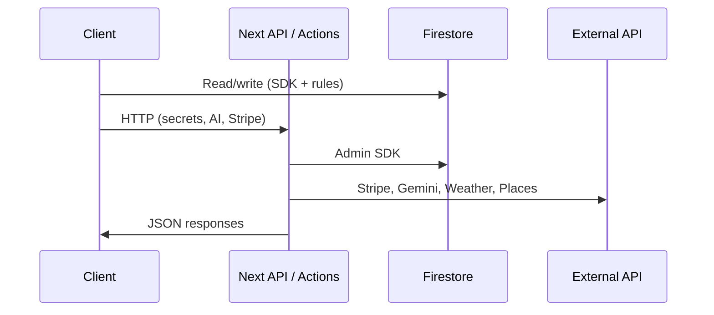

# Backend Architecture (Groundzy → v3)

In Groundzy, “backend” means **Firebase** (managed services) plus **Next.js server** (API routes, server actions) and **external APIs**. There is no separate Groundzy monolith server beyond Next.

---

## 1. Current architecture

### Firebase (primary data plane)

| Service | Role |
|---------|------|
| **Firebase Auth** | User identity; sessions on client |
| **Firestore** | Primary database: trees, zones, clients, properties, requests, quotes, jobs, invoices, teams, users, `work_items`, `tree_events`, share links, etc. |
| **Firebase Storage** | Images, attachments, AI chat files |
| **Security** | `firebase/firestore.rules`, `firebase/storage.rules` — enforce access by uid, `organizationId`, `databaseCode`, roles |

**Scoping:** Individual data often uses **`databaseCode`**; team data uses **`organizationId`** (`docs/architecture/complete-architecture-documentation.md`).

### Next.js server

| Mechanism | Role |
|-----------|------|
| **API routes** (`app/api/**/route.ts`) | Stripe webhooks, AI proxy, weather, Places, quick-picks, share resolution, tree operations needing admin or secrets |
| **Server actions** (`app/actions/*.ts`) | Auth, payment, team flows with server-side validation |
| **Firebase Admin SDK** | Used from API routes/actions for privileged Firestore access, custom tokens, etc. |

Representative routes: see `docs/reference/api-routes.md` (health, auth, AI, species, trees, weather, Stripe, places, quick-picks, share, teams, …).

### Stripe

- Checkout, customer portal, subscription lifecycle.
- Webhooks update user/org subscription fields.
- Client never holds secret keys; logic in API routes.

### External services (via API routes or client where appropriate)

- **Google Generative AI** — chat, summaries (usage limits enforced server-side where implemented).
- **Weather** — Visual Crossing / WeatherAPI.com patterns in repo (`/api/weather/*`).
- **Google Places** — nearby tree services.
- **Resend** — transactional email (where integrated).

---

## 2. Data flow (backend-centric)

**Webhook path:** Stripe → `/api/stripe/webhook` → verify signature → update Firestore user/org → client reads updated subscription on next load or realtime.

---

## 3. Coupling and risks (current)

- **Business rules** split between **Firestore rules**, **client hooks**, and **API routes** — must stay aligned for security (rules are authoritative for direct client access).
- **`work_items` dual-write** from tree history and workflow — operational complexity (see product/audit docs).
- **Indexes** — Composite indexes required for many queries (`firebase/firestore.indexes.json`); v3 domain design should **minimize** query explosion.

---

## 4. v3 backend architecture (target)

### Principles

| Principle | Implementation |
|-----------|----------------|
| **Single domain model** | Firestore collections and types align with **domain modules**; avoid parallel mirror collections long-term. |
| **Authoritative security** | Rules express **must-hold** invariants; server routes validate same for Admin paths. |
| **Thin API surface** | API routes exist for **secrets**, **webhooks**, **rate limits**, **aggregation** — not for every CRUD that Firestore can do safely. |
| **Repository pattern** | All Firestore access from domains goes through **repositories** (testable, swappable for emulators). |

### Optional evolution (program decision)

- **Cloud Functions** for async workflows (notifications, heavy denormalization) — not required for v3 definition but compatible with Firebase.
- **Alternate DB** for analytics or search — out of scope unless product selects it; architecture should **isolate** reporting behind interfaces.

---

## Related

- [`system-overview.md`](./system-overview.md)
- [`state-management.md`](./state-management.md)
- Firebase: `firebase/firestore.rules`, `docs/firebase/README.md` (if present)
