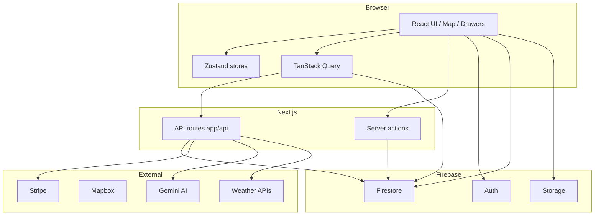

# System Overview (Groundzy → v3)

High-level architecture of the **current** Groundzy application and the **target shape** for Groundzy v3: module boundaries, coupling, and data flow.

**Evidence base:** `docs/architecture/complete-architecture-documentation.md`, `docs/PROJECT_OVERVIEW.md`, `firebase/`, `app/api/`.

---

## 1. Current system (as implemented)

Groundzy is a **Next.js App Router** web app with a **single-page main shell** (map + work area + drawers). **Firebase** is the primary backend (Auth, Firestore, Storage). **Stripe** handles subscriptions. **Next.js API routes** and **server actions** bridge secrets, webhooks, and privileged operations. External services include **Mapbox**, **Google Generative AI (Gemini)**, weather APIs, **Google Places** (Hire a Pro), **Resend** (email), etc.



---

## 2. Major subsystems and coupling

| Subsystem | Responsibility | Coupled to |
|-----------|----------------|------------|
| **Map + selection** | Mapbox map, markers, zones, draw/measure | `map-store`, `selection-store`, tree/zone/property queries |
| **Drawer shell** | Work area, lazy drawers, URL sync | `navigation-store`, `lib/drawers.ts`, `work-area-content.tsx` |
| **Domain data** | Trees, clients, CRM, workflow | Firestore + React Query hooks in `hooks/`, `lib/firebase/` |
| **Auth + tier** | User session, subscription | Firebase Auth, user doc, `tier-utils`, drawer visibility |
| **Billing** | Checkout, portal, webhooks | Stripe + API routes + user doc fields |
| **AI / weather** | Chat, identify, forecasts | API routes + external APIs + usage limits |
| **Sharing** | Share tokens, public views | `app/share/[token]/`, Firestore rules |

**Tight coupling today:**

- **UI ↔ URL ↔ navigation store** — Drawer identity and history are split between URL params and Zustand (`drawerHistory`).
- **Trees ↔ history ↔ work_items** — Dual paths for activity/work (see `Groundzy v3/00-foundation/rebuild-audit-history-and-uiux.md`).
- **CRM workflow ↔ navigation** — Deep linking via query params; business rules also in Firestore + conversion helpers.
- **Tier logic** — Repeated concerns: `visibleForTiers`, `tier-utils`, Firestore rules, feature flags.

---

## 3. Data flow (simplified)

1. **Read path:** Component → React Query hook → `lib/firebase/*` client SDK → Firestore → cache → UI.
2. **Write path:** Form / action → mutation hook → Firestore write → invalidation → refetch (or optimistic update).
3. **Privileged path:** Client → Next API route or server action → Firebase Admin / Stripe / external API → response.
4. **Realtime:** Primarily pull-based via Query; specific listeners may exist per hook (verify in `hooks/` for subscriptions).

---

## 4. v3 architectural goals

Aligned with [`Groundzy v3/00-foundation/principles.md`](../00-foundation/principles.md) and [`Groundzy v3/02-design/design-system.md`](../02-design/design-system.md):

| Goal | Meaning |
|------|---------|
| **Clear module boundaries** | Domains (inventory, CRM, workflow, map, billing, platform) own types, data access, and use-cases—not scattered across `lib/` without structure. |
| **One conceptual model per domain** | Single event/work story, single tier model in UX and schema directionally. |
| **Thin features** | Feature routes/drawers orchestrate; they do not embed Firebase or Stripe details. |
| **Explicit integration layer** | API client / repository interfaces for Firestore and HTTP; easier to test and swap. |
| **Unified presentation** | Groundzy UI only at feature edge (design system). |

---

## 5. v3 target structure (proposal)

Conceptual layout (exact folder names are a repo decision):

```
src/
  domains/           # Inventory, crm, workflow, map, billing, ai — each: types, repos, hooks facade
  platform/          # auth, navigation, telemetry, feature flags
  ui/                # Groundzy UI (design system)
  app/               # Next.js routes, thin composition
```

**Rules of thumb:**

- **Domains** do not import from **app/drawers**; drawers import from domains.
- **Cross-domain** orchestration (e.g. job → tree event) lives in a **small application service** layer or explicit use-case modules—not duplicated in three drawers.

---

## Related

- [`frontend-architecture.md`](./frontend-architecture.md)
- [`backend-architecture.md`](./backend-architecture.md)
- [`state-management.md`](./state-management.md)
- [`routing-and-navigation.md`](./routing-and-navigation.md)
