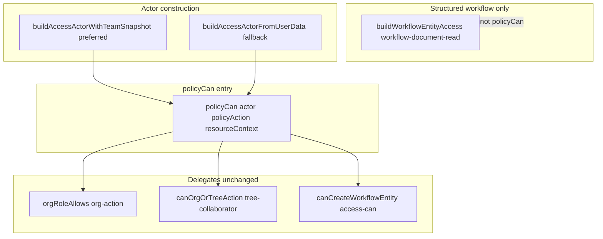

# Implementation plan: unified `policyCan(actor, action, resourceContext)` surface

**Status:** Proposal (engineering)  
**Audience:** Backend and policy maintainers  
**Depends on:** [Unified permission model (v3)](./unified-permission-model-v3.md), [Organization roles & access](./organization-roles-and-access.md), [OrgAction policy matrix](./org-action-policy-matrix.md)

**Related code:** [`lib/groundzy/policy/org-action.ts`](../../../app/lib/groundzy/policy/org-action.ts), [`lib/groundzy/policy/access/actor.ts`](../../../app/lib/groundzy/policy/access/actor.ts), [`lib/groundzy/policy/access/can.ts`](../../../app/lib/groundzy/policy/access/can.ts), [`lib/groundzy/policy/tree-collaborator.ts`](../../../app/lib/groundzy/policy/tree-collaborator.ts), [`lib/server/workflow-document-read.ts`](../../../app/lib/server/workflow-document-read.ts), [`lib/groundzy/policy/entity-classification.ts`](../../../app/lib/groundzy/policy/entity-classification.ts).

---

## Naming (use `policyCan`, not `can`)

The generic name **`can`** is easy to confuse with unrelated helpers, hard to **`grep`** safely, and tends to accumulate overloads.

**Chosen export name:** **`policyCan`** (alternatives considered: `canPolicy`, `canActor`).

- **Convention:** **`policyCan`** = boolean permission router for **org / tree / workflow-create** checks that stay **pure or sync** given already-loaded inputs.
- **Do not** name the workflow envelope API `can*` — keep **[`buildWorkflowEntityAccess`](../../../app/lib/server/workflow-document-read.ts)** (or a future **`getWorkflowAccess`** alias **only** as a thin re-export for discoverability).

---

## Objective

Introduce a **single, documented entry point** for server-side **boolean** permission evaluation:

- **`policyCan(actor, policyAction, resourceContext)`** aligns with the v3 access doc (`Actor + Resource + Action`).
- **Delegates** to existing modules (`orgRoleAllows`, `canOrgOrTreeAction`, `canCreateWorkflowEntity`, entitlements checks) — **no duplicate matrix**.
- **Does not** subsume **`buildWorkflowEntityAccess`** (structured workflow access stays a **separate** API).

This plan **does not** replace Firestore rules or redefine the locked architecture (writes server-authoritative, reads coarse in rules).

---

## Current State

### Existing types and builders

| Artifact | Location | Role today |
|----------|-----------|------------|
| **`OrgAction`** union + **`orgRoleAllows`** | [`lib/groundzy/policy/org-action.ts`](../../../app/lib/groundzy/policy/org-action.ts) | Single matrix for org-scoped CRM/workflow/team actions. |
| **`AccessActor`** | [`lib/groundzy/policy/access/actor.ts`](../../../app/lib/groundzy/policy/access/actor.ts) | `uid`, `effectiveTier`, `entitlements`, `orgMemberships`, `principalKeys`. Built via **`buildAccessActorFromUserData(uid, userData)`** from Firestore **`users`** doc only. |
| **`canCreateWorkflowEntity`** | [`lib/groundzy/policy/access/can.ts`](../../../app/lib/groundzy/policy/access/can.ts) | Subset of workflow **create** commands; gates **`workflowPipeline`** + **`orgRoleAllows`** for team org; solo org (`organizationId === uid`) bypasses role matrix per comments. |
| **`assertOrgRoleAllows` / `parseTeamRoleFromUserDoc`** | [`lib/groundzy/policy/assert-org-role.ts`](../../../app/lib/groundzy/policy/assert-org-role.ts) | Throws on deny; parses **`users.role`** for server routes (trees permissions, transfer, tree-sharing-grant). **Overlaps** `parseTeamRoleFromUserDoc` in [`actor.ts`](../../../app/lib/groundzy/policy/access/actor.ts) (two implementations — duplicate maintenance risk). |
| **`canOrgOrTreeAction`** | [`lib/groundzy/policy/tree-collaborator.ts`](../../../app/lib/groundzy/policy/tree-collaborator.ts) | Composes **`orgRoleAllows`** with **`tree_permissions`** grant + active collaborator flags for **`OrgAction`** tree update/delete-style decisions. |
| **`evaluateWorkflowDocumentRead`**, **`buildWorkflowEntityAccess`** | [`lib/server/workflow-document-read.ts`](../../../app/lib/server/workflow-document-read.ts) | Async: structured **`RequestAccess` / `QuoteAccess` / …** — authoritative envelope for **`GET`** [`participant-get`](../../../app/api/workflow/participant-get/[entity]/[id]/route.ts). |
| **`compute*Access`** | [`lib/groundzy/policy/access/compute-entity-access.ts`](../../../app/lib/groundzy/policy/access/compute-entity-access.ts) | Pure: maps **`WorkflowResourceRole`** + gates to typed flags. |
| **Entity classification constants** | [`lib/groundzy/policy/entity-classification.ts`](../../../app/lib/groundzy/policy/entity-classification.ts) | CRM vs system collections (policy documentation + future gates). |
| **Client UI matrix** | [`lib/permissions-utils.ts`](../../../app/lib/permissions-utils.ts) | **`getPermissionsForRole`** wraps **`orgRoleAllows`** — client optimistic only. |

### Permission entry points (representative)

- **Workflow participant GET:** [`buildWorkflowEntityAccess`](../../../app/lib/server/workflow-document-read.ts) → **structured only** (not `policyCan`).
- **Workflow create / append:** [`canCreateWorkflowEntity`](../../../app/lib/groundzy/policy/access/can.ts) in [`can-append-event.ts`](../../../app/lib/groundzy/policy/can-append-event.ts) → eventual **`policyCan`** branch (**boolean**).
- **Trees (API):** [`assertOrgRoleAllows`](../../../app/lib/groundzy/policy/assert-org-role.ts), [`canOrgOrTreeAction`](../../../app/lib/groundzy/policy/tree-collaborator.ts) under [`app/api/trees/`](../../../app/app/api/trees/).
- **Team actions:** [`verifyOwnerOrAdmin`](../../../app/app/actions/team.ts) uses **`teams.memberRoles`** / **`ownerId`** — **parallel mini-system** to **`OrgAction`** ([§ Phase X](#phase-x--team-actions-alignment)).

### Gaps relative to locked v3 docs

- **`buildAccessActorFromUserData`** fills **`orgMemberships[].role`** from **`users.role`** only. Canonical **`teams.memberRoles[uid]`** **must** be used whenever the team document is already loaded ([unified-permission-model-v3.md](./unified-permission-model-v3.md) §2). **Mandatory:** introduce **`buildAccessActorWithTeamSnapshot`** (see below) — **not** optional polish.

---

## Return types (locked — do not mix)

| API | Returns | Use for |
|-----|---------|---------|
| **`policyCan(...)`** | **`boolean`** only — **synchronous**. | Org-only checks, tree composite checks, workflow **create** boolean gate (delegates to **`canCreateWorkflowEntity`**). |
| **`buildWorkflowEntityAccess(...)`** (existing) | **Structured** `RequestAccess` \| `QuoteAccess` \| … | Workflow **read** and per-field mutate flags after async evaluation. |
| **Future `policyCanAsync(...)`** | **`Promise<boolean>`** only — if ever needed for a check that **must** `await` inside the policy router itself. | **Avoid** unless unavoidable; prefer loading data **before** calling **`policyCan`**. |

**Forbidden:** One function returning **`boolean | StructuredAccess`** or **`boolean | Promise<boolean>`** intermixed without clear naming — that caused inconsistent call sites.

---

## Actor construction (explicit)

| Builder | Role |
|---------|------|
| **`buildAccessActorFromUserData(uid, userData)`** | **Legacy / fallback** when **`teams/{orgId}`** is **not** available. Uses **`users.role`** for **`orgMemberships`** when valid — **cache path**, acceptable only when canonical snapshot cannot be loaded. |
| **`buildAccessActorWithTeamSnapshot(uid, userData, teamDoc)`** | **Preferred** whenever **`teams/{organizationId}`** is already loaded for the request. Sets **`orgMemberships[].role`** from **`teamDoc.memberRoles[uid]`** (canonical). Still merges **`entitlements`** / **`effectiveTier`** from **`userData`** per existing **`buildAccessActorFromUserData`** logic. |

**Rule (normative for implementation):**

> **Any server route or server action that already reads `teams/{teamId}` for the acting user MUST build the actor with `buildAccessActorWithTeamSnapshot`**, not **`buildAccessActorFromUserData`** alone — unless a documented exception (e.g. migration shim, rare code path with only user doc).

This reduces **`users.role`** leakage into policy evaluation when canonical data exists.

---

## Target `policyCan` shape

### Signature (server-only)

```ts
type PolicyAction =
  | { kind: "org"; action: OrgAction }
  | { kind: "org_tree"; action: OrgAction } // delegates to canOrgOrTreeAction for tree-related OrgActions
  | { kind: "workflow_create"; action: WorkflowAction }

function policyCan(
  actor: AccessActor,
  policyAction: PolicyAction,
  resourceContext: ResourceContext
): boolean
```

- **No** `workflow_read` kind on **`policyCan`** — workflow read stays **`await buildWorkflowEntityAccess(...)`**.
- **`ResourceContext`:** discriminated union aligned with **[`canOrgOrTreeAction`](../../../app/lib/groundzy/policy/tree-collaborator.ts)** inputs and org-only **`organizationId`** resolution for **`kind: "org"`**.

### Composition rules (unchanged from repo behavior)

1. **Org role:** **`orgRoleAllows`** via **`actor.orgMemberships`** when team-scoped.
2. **Tree:** **`canOrgOrTreeAction`** — order and collaborator rules unchanged.
3. **Workflow create:** **`canCreateWorkflowEntity`** inside **`policyCan`** — unchanged semantics.
4. **Workflow read / record envelopes:** **`buildWorkflowEntityAccess`** only — **not** **`policyCan`**.

---

## Call site patterns

Bridge from **docs → implementation**: same patterns in API routes.

### Example: Tree API route (sync boolean)

After loading **`users`**, **`trees`**, and (when applicable) **`teams`** for canonical role:

```ts
const actor = buildAccessActorWithTeamSnapshot(uid, userData, teamSnap.data());
const allowed = policyCan(
  actor,
  { kind: "org_tree", action: "org.tree.update" },
  treeResourceContext // fields required by canOrgOrTreeAction + tree collaborator state
);

if (!allowed) {
  return NextResponse.json({ error: "Forbidden" }, { status: 403 });
}
```

If the route **does not** load **`teams`**, document **why** or add the read — fallback:

```ts
const actor = buildAccessActorFromUserData(uid, userData);
// acceptable only when team doc intentionally skipped; prefer fixing the route to load team
```

### Example: Workflow record read (structured — not `policyCan`)

```ts
const access = await buildWorkflowEntityAccess(db, uid, userData, docData, entity);
if (!access.canRead) {
  return NextResponse.json({ error: "Forbidden" }, { status: 403 });
}
// use access.canUpdate, access.canComment, etc. — never collapse to a single boolean from mixed APIs
```

### Example: Workflow append / create command (boolean)

```ts
const actor = buildAccessActorWithTeamSnapshot(uid, userData, teamData);
const ok = policyCan(actor, { kind: "workflow_create", action: "workflow.request.create" }, {
  type: "org_command",
  organizationIdForCommand: orgId,
});
if (!ok) throw new ForbiddenError();
```

*(Exact **`ResourceContext`** for **`workflow_create`** matches what **`canCreateWorkflowEntity`** needs today — **`organizationIdForCommand`** and membership resolution.)*

---

## Proposed internal architecture



- **`policyCan`** is a **sync router**: no duplicate matrix logic inside it.
- **`assertOrgRoleAllows`** migrates to **`policyCan`** + throw (or **`assertPolicyAllows`** wrapper).

### What stays separate vs unified

| Keep separate | Rationale |
|---------------|-----------|
| **`buildWorkflowEntityAccess`** | Returns **structured** types — **never** merge into **`policyCan`**. |
| **Firestore rules** | Coarse boundary only. |
| **Team admin gate (`verifyOwnerOrAdmin`)** until Phase X | Uses **ownerId / memberRoles admin** — see [Phase X](#phase-x--team-actions-alignment). |
| **Client `getPermissionsForRole`** | Optimistic UI only. |

| Unify over time | Rationale |
|-----------------|-----------|
| Single **`parseTeamRoleFromUserDoc`** | Shared by **`actor.ts`** and **`assert-org-role.ts`**. |
| Tree API routes | **`policyCan`** + **`buildAccessActorWithTeamSnapshot`**. |
| **`can-append-event`** | **`policyCan`** → **`canCreateWorkflowEntity`**. |

---

## Migration plan

Conservative phases — no big-bang.

1. **Phase 0 — Types + `policyCan` stub**  
   - **`PolicyAction`**, **`ResourceContext`**, **`policyCan`** for **`kind: "org"`** → **`orgRoleAllows`**.  
   - **Tests:** equivalence vs **`orgRoleAllows`**.

2. **Phase 1 — Org + tree composite**  
   - **`kind: "org_tree"`** → **`canOrgOrTreeAction`**.  
   - Migrate **[`archive`](../../../app/app/api/trees/archive/route.ts)**, **[`permissions`](../../../app/app/api/trees/[treeId]/permissions/route.ts)**, **[`transfer-ownership`](../../../app/app/api/trees/transfer-ownership/route.ts)** incrementally.  
   - Introduce **`buildAccessActorWithTeamSnapshot`** and **use it** in those routes when **`teams`** is loaded.

3. **Phase 2 — Workflow create**  
   - **`policyCan`** **`workflow_create`** → **`canCreateWorkflowEntity`**; wire **`can-append-event`**.

4. **Phase 3 — Enforcement of canonical actor**  
   - Audit server routes: any path with **`teams`** read **must** use **`buildAccessActorWithTeamSnapshot`**. Lint or checklist in PR template (**implementation detail**).

5. **Phase 4 — Naming discoverability**  
   - Optional **`getWorkflowAccess`** export alias for **`buildWorkflowEntityAccess`** (re-export only — **same** structured return).

### Phase X — Team actions alignment

[`app/actions/team.ts`](../../../app/app/actions/team.ts) uses **`verifyOwnerOrAdmin`** (**`teams.ownerId`**, **`memberRoles[uid] === 'admin'`**) — **not** **`OrgAction`** / **`orgRoleAllows`**. That is a **second authority model** overlapping **`org.team.member.invite`**, **`org.team.member.role_update`**, etc.

**Choose one direction (product + security):**

| Option | Work |
|--------|------|
| **A — Map into policy** | Express invite / role update / remove as **`OrgAction`** checks where possible; **`policyCan(actor, { kind: 'org', action }, { type: 'team_admin', teamId })`** with **`actor`** built from canonical **`teams`**. Some checks (e.g. **admin cannot demote admin**) remain **`team-admin-peer-rule`** **after** **`policyCan`** allows base admin capability. |
| **B — Document parallel authority** | Explicit doc section: **“Team document admin model”** vs **`OrgAction`** — when to call **`verifyOwnerOrAdmin`** vs **`policyCan`**; **no** silent overlap. |

**Do not** leave team actions **half-in, half-out** indefinitely — Phase X is **required** for long-term consistency.

**Order:** Run **after** Phases 0–2 stabilize **`policyCan`** and canonical actor usage.

---

## Testing plan

| Layer | Tests |
|-------|--------|
| **`policyCan` router** | Unit tests: each **`PolicyAction`** branch **boolean**-matches direct delegate with same fixtures. |
| **Regression** | **[`org-action.test.ts`](../../../app/lib/groundzy/policy/org-action.test.ts)**, **[`tree-collaborator.test.ts`](../../../app/lib/groundzy/policy/tree-collaborator.test.ts)**, **[`can.test.ts`](../../../app/lib/groundzy/policy/access/can.test.ts)** unchanged as primitive sources of truth. |
| **`buildAccessActorWithTeamSnapshot`** | Unit tests: **`orgMemberships[].role`** equals **`team.memberRoles[uid]`** when present. |
| **Integration** | Optional route tests — **only if** repo pattern exists (unchanged caveat). |

---

## Risks / edge cases

| Risk | Mitigation |
|------|------------|
| **Canonical team doc not loaded** | **`buildAccessActorFromUserData`** fallback — **document** in route; prefer loading **`teams`**. |
| **`users.role` drift vs `memberRoles`** | **`logTeamMemberRoleDriftIfAny`** when both available ([`team-role-invariant.ts`](../../../app/lib/groundzy/policy/team-role-invariant.ts)). |
| **Collaborator stronger than org role** | **`canOrgOrTreeAction`** unchanged; **`policyCan`** passes full tree context. |
| **Participant vs non-participant workflow** | **`buildWorkflowEntityAccess`** only — **`policyCan`** does not reorder workflow read logic. |
| **CRM vs system-class deletes** | Route **`policyCan`** / dedicated helpers using **`entity-classification.ts`**; rules remain separate safety net. |
| **Solo org (`organizationId === uid`)** | Preserve **`canCreateWorkflowEntity`** / **`buildAccessActorFromUserData`** solo behavior. |
| **Missing `users.role` for team user** | **`buildAccessActorFromUserData`** may omit **`orgMemberships`** — **deny** team **`policyCan`** that requires membership (existing semantics). |

---

## Out of scope

- Redefining **`OrgAction`** matrix or **new roles**.
- Changing **locked** architecture in [unified-permission-model-v3.md](./unified-permission-model-v3.md).
- Mirroring **full** composition in **`firebase/firestore.rules`**.
- Replacing **`verifyOwnerOrAdmin`** in **one PR** — handled in **[Phase X](#phase-x--team-actions-alignment)**.
- Client-side **security** using **`policyCan`** without server confirmation for mutations.

---

## Open questions (explicit)

1. **`ResourceContext`** for **zones / zone_services** — defer until routes migrate or keep **org-only** subset.

2. **`OrgAction`** literals for **system-index** deletes — requires [org-action-policy-matrix.md](./org-action-policy-matrix.md) PR if added; until then dedicated small helpers + **`entity-classification.ts`**.

3. **`policyCanAsync`** — introduce **only** if a boolean check **must** await inside the router; default is **sync `policyCan`** + load data **before** call.
