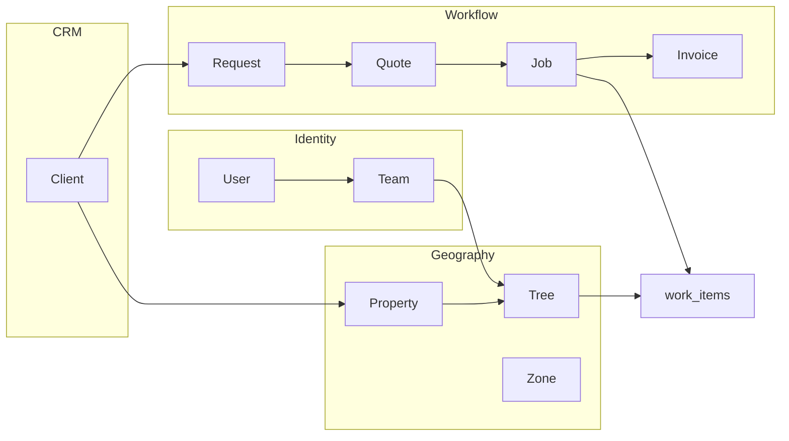

# Data Model Overview

High-level map of Groundzy’s **Firestore-backed** (and related) data system, major groupings, and boundaries. Authoritative collection list: **`firebase/firestore.rules`**; TypeScript shapes: **`types/*.ts`**.

---

## 1. Major entity groups

| Group | Scope | Core collections / paths |
|-------|--------|---------------------------|
| **Identity & access** | Global | `users/{userId}`, `usernames/{username}`, `users/.../sessions`, `users/.../gallery`, `users/.../profile_public/profile`, `admins/{uid}` |
| **Teams & orgs** | Multi-user | `teams/{teamId}`, `team_members/{memberId}`, `organizations/{orgId}`, `invite_codes/{inviteCodeId}` |
| **Geography & inventory** | Org- or database-scoped | `trees/{treeId}`, `zones/{zoneId}`, `zones/{zoneId}/zone_services/{serviceId}`, `properties/{propertyId}`, `tree_number_counters/{scopeId}` |
| **CRM** | Org | `clients/{clientId}` |
| **Workflow (commercial)** | Org | `requests/{requestId}`, `quotes/{quoteId}`, `jobs/{jobId}`, `invoices/{invoiceId}`, `recurring_plans/{planId}`; **workflow defaults** stored embedded on **`teams/{teamId}`** (`workflowSettings` field, `getTeamWorkflowSettings` in `lib/firebase/firestore.ts`) |
| **Work index** | Org | `work_items/{workItemId}` |
| **Tree history (storage)** | Per tree | `tree_events/{treeId}/events/{eventId}` |
| **Tree media** | Per tree | `tree_media/{treeId}/media/{mediaId}` |
| **Sharing & visibility** | Cross-user | `tree_share_links/{token}`, `tree_permissions/{treeId}/members/{userId}`, `user_tree_permissions/{userId}/trees/{treeId}`, `tree_access_requests/{requestId}`, `tree_public/{treeId}`, `tree_public_summaries/{summaryId}` |
| **Community / social** | Mixed | `groundzy_posts`, `community_posts` (with subcollections), `species_catalog`, quick-pick collections |
| **Messaging** | Users | `conversations/{conversationId}/messages/{messageId}`, `ai_chats/{chatId}/messages/{messageId}` |
| **Notifications & ops** | Users / system | `notifications/{notificationId}`, `mail/{mailId}`, `pro_contact_requests`, `groundzy_pros` |
| **Social publishing (optional)** | Org | `social_themes`, `social_schedules`, `social_posts`, `social_assets`, `social_settings` |

**Not persisted as domain entities:** **Weather** and **Places** results are fetched via API routes (`/api/weather/*`, `/api/places/*`) and cached in memory or client—not a first-class Firestore “weather record” collection.

---

## 2. Conceptual relationships (between groups)

**System boundaries:**

- **Inventory** (trees/zones/properties) anchors **where** work applies.
- **CRM** anchors **who** is billed or contacted.
- **Workflow** documents are the **commercial spine** (lead → cash).
- **`work_items`** is a **cross-cutting index** (operational + mirrored workflow rows)—see [`event-system.md`](./event-system.md).

**Groundzy v3:** The diagram above reflects **legacy** links. In v3, **Events** are canonical; **`work_items`**-style data is **not** a parallel truth—see §4 and [`event-system.md`](./event-system.md).

### Job lifecycle (commercial document)

- **Statuses** live on `jobs/{jobId}` (`types/job.ts`). Allowed one-step transitions (draft → scheduled → … → cancelled, completion, billing queue) are enforced in the app via [`lib/workflow/job-status-transitions.ts`](../../lib/workflow/job-status-transitions.ts).
- **Mark complete** (view/edit job) sets `status: completed` and `completedAt`.
- **First invoice from a job**: `convertJobToInvoice` in `lib/firebase/firestore.ts` uses a **batch** to create the invoice and set **`primaryInvoiceId`** and **`invoicedAt`** on the job. If the job was **`requires_invoicing`**, status is normalized to **`completed`** once the invoice exists.
- **Invoice paid**: when `updateInvoice` sets the invoice to **`paid`**, the linked job (via `jobId`) receives **`paidAt`** (denormalized timestamp) for continuity in job views and lists.

---

## 3. Data problems (summary)

Details: [`entities.md`](./entities.md) (overlaps), [`relationships.md`](./relationships.md) (gaps), [`event-system.md`](./event-system.md) (history fragmentation).

| Problem | Summary |
|---------|---------|
| **Duplicate history representations** | Tree activity in `tree.history`, `tree_events`, and mirrored `work_items`; UI merge flags (`UserPreferences`). |
| **Workflow vs Work Item** | CRM docs are canonical for billing; `workflow_*` work items are **LEGACY_MIRROR** (`types/work-item.ts`). |
| **Naming** | `Team` vs `organizationId` on user; `teams` collection vs `organizations` collection—both exist in rules. |
| **Indirect links** | Some relationships only via URL navigation + foreign keys; audits noted conversion/backlink gaps (historical docs). |

### Data problems (explicit list)

- **Duplicated systems:** Embedded tree history + `tree_events` + `work_items` operational rows + `workflow_*` mirrors; multiple ways to represent “work happened.”
- **Inconsistent models:** `Job` (workflow) vs `WorkItem` with `workflow_job`; `Request` (CRM) vs `tree_access_requests` (permissions)—same words, different entities.
- **Weak relationships:** Optional FKs only; soft deletes with snapshots; no DB-enforced cascades; deprecated `tree.business.activeJobIds` vs job `treeIds`.
- **Unclear ownership:** Whether **`work_items`** is source of truth or **CRM docs** is ambiguous—code comments mark mirrors as legacy.
- **Feature-specific structures:** `UserPreferences` flags (`workItemsActivityTimelineEnabled`) change **UI** merge behavior without changing a single backend event model.
- **Tier vs rules:** Subscription tier gates **product UI**; many Firestore rules use **org membership** and **tree permissions**, not tier strings—two parallel access stories.

---

## 4. Groundzy v3 data model (decided)

Locked to [`Groundzy v3/00-foundation/principles.md`](../00-foundation/principles.md) (**event-first**). This is the **target architecture**, not the legacy app’s current storage.

| Direction | v3 rule |
|-----------|---------|
| **Events** | **Single append-only canonical model** for all actions. **History** and **activity** are not separate products—they are **queries/projections** over Events (plus privacy/redaction rules). Implementation may use Firestore collections, structured event documents, and materialized views as needed—**without** requiring event-stream infrastructure beyond product requirements. |
| **Workflow** | **Request / Quote / Job / Invoice** remain **commercial documents** for lifecycle, line items, and billing. **State transitions** are recorded as **Events**; do **not** maintain parallel “mirror” rows as a second source of truth. |
| **Work Item** | **Not** canonical. Any **WorkItem**-shaped data (including legacy `work_items`) is a **projection**, index, or UI/scheduling aid **derived** from Events and/or workflow documents—never a second system of record. |
| **Naming** | Single **Organization** concept aligning `teams`, `organizations/{orgId}`, and user `organizationId`. |
| **Tree** | **One write path** into the canonical Event model for tree-scoped actions; migration may choose concrete storage (e.g. subcollection vs embedded) but **one** authoritative event story. |

---

## 5. File reference appendix

### Entities & types

- `types/tree.ts`, `types/zone.ts`, `types/property.ts`, `types/client.ts`
- `types/request.ts`, `types/quote.ts`, `types/job.ts`, `types/invoice.ts`
- `types/work-item.ts`, `types/recurring-plan.ts`, `types/zone-service.ts`
- `types/team.ts`, `types/ai-chat.ts`, `types/conversation.ts`, `types/session.ts`, `types/gallery.ts`

### Workflow

- `lib/workflow/*` (including `job-status-transitions.ts`), `types/workflow-settings.ts` (if present)

### History / activity

- `types/tree.ts` (`TreeHistory`, `TreeEvent`, `PublicActivityEntry`)
- `lib/firebase/firestore.ts` (tree history / `tree_events`)
- `lib/firebase/work-items.ts`, `lib/workflow/work-item-adapters.ts`

### CRM / map

- `types/property.ts`, `types/client.ts`
- `lib/firebase/firestore.ts` (CRUD helpers)

### Teams / users

- `types/team.ts`, `lib/firebase/firestore.ts` (`UserPreferences`, user updates)
- `firebase/firestore.rules` (teams, users, organizations)

### Rules (authoritative access)

- `firebase/firestore.rules`

---

## Related

- [`entities.md`](./entities.md)
- [`relationships.md`](./relationships.md)
- [`data-flows.md`](./data-flows.md)
- [`event-system.md`](./event-system.md)
- [`permissions.md`](./permissions.md)
