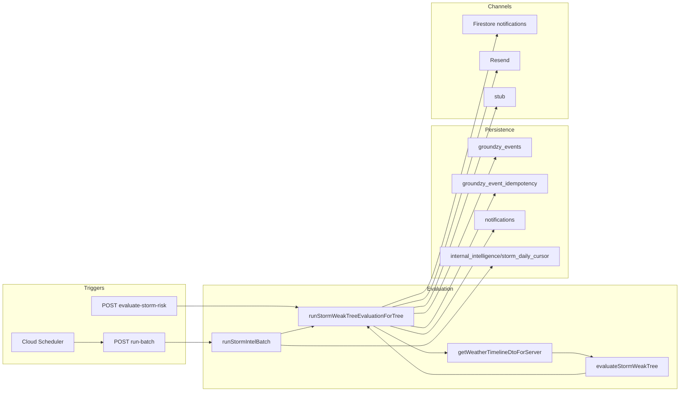

# Groundzy Intelligence System — Audit Report

**Scope:** `app.groundzy` (C:/Groundzy/app) and Groundzy v3 docs (C:/Groundzy/docs).  
**Method:** Code-first; docs used for comparison only.  
**Date:** As of repository state at audit time.

---

## 1. Executive Summary

- **Implemented:** One intelligence event type (`intelligence.alert_triggered`) with Zod payload, Admin-only append with transactional idempotency (`intel:${dedupeKey}` → `groundzy_event_idempotency`), system actor via `GROUNDZY_INTELLIGENCE_ACTOR_UID`, one rule (`combined.storm_weak_tree_v1`) in [`lib/intelligence/storm-weak-tree.ts`](C:/Groundzy/app/lib/intelligence/storm-weak-tree.ts), orchestration in [`run-storm-weak-tree-evaluation.ts`](C:/Groundzy/app/lib/intelligence/run-storm-weak-tree-evaluation.ts), internal HTTP APIs (`evaluate-storm-risk`, `run-batch`), batch cursor in `internal_intelligence/storm_daily_cursor`, in-app `notifications` rows with `actions[].route` via [`buildDrawerHref`](C:/Groundzy/app/lib/drawer-utils.ts), [`decideIntelligenceChannels`](C:/Groundzy/app/lib/notifications/channel-routing.ts), Resend plaintext email in [`intelligence-email-resend.ts`](C:/Groundzy/app/lib/notifications/intelligence-email-resend.ts), Activity tab UI in [`ActivityTab.tsx`](C:/Groundzy/app/components/inbox/ActivityTab.tsx).

- **Works end-to-end for:** Secured cron/manual POST → weather fetch (Visual Crossing when `VISUALCROSSING_API_KEY` set) → optional event append → optional Firestore notification → optional email (when Resend + email capability + address present). Idempotency prevents duplicate **events** for the same `dedupeKey` per org.

- **Not implemented / stub:** SMS ([`intelligence-sms.ts`](C:/Groundzy/app/lib/notifications/intelligence-sms.ts) no-op). No projection handler for `intelligence.alert_triggered` ([`handlers/index.ts`](C:/Groundzy/app/lib/groundzy/projections/handlers/index.ts) has no intelligence entry) — effects array is empty; tree/notification writes are **direct** in the evaluator, not via projection pipeline.

- **Largest product/code gaps:** (1) **User notification preferences are not loaded** — storm path passes **hardcoded** `{ emailOptIn: true, smsCriticalOptIn: false }` in [`run-storm-weak-tree-evaluation.ts`](C:/Groundzy/app/lib/intelligence/run-storm-weak-tree-evaluation.ts) (lines 142–146). (2) **Tier gate** [`canRunStormWeakTreeIntelligence`](C:/Groundzy/app/lib/intelligence/tier.ts) returns **always `true`** — capability/tier matrix is not enforced for “may run rule.” (3) **Email** is plain text only — no Resend templates, no unsubscribe token in intelligence path. (4) **Weather cache** is process-local memory ([`lib/weather/cache.ts`](C:/Groundzy/app/lib/weather/cache.ts)) — weak cross-instance deduplication on serverless. (5) **`internal_intelligence`** cursor collection has **no explicit rule block** before default deny — client access is denied by catch-all; Admin-only is correct but undocumented in rules comments.

- **Maturity:** **Functional** for a single vertical slice (storm × weak tree) with internal automation; **not** fully **production-ready** for enterprise expectations on prefs, observability (beyond console JSON log for batch), SMS, and strict tier alignment — see Section 7.

---

## 2. System Map (Actual)

**Narrative (actual file flow):**

1. **Trigger:** External caller (Cloud Scheduler, script, or tool) `POST`s to [`app/api/internal/intelligence/evaluate-storm-risk/route.ts`](C:/Groundzy/app/app/api/internal/intelligence/evaluate-storm-risk/route.ts) with JSON `{ treeId }` **or** to [`.../run-batch/route.ts`](C:/Groundzy/app/app/api/internal/intelligence/evaluate-storm-risk/run-batch/route.ts) with optional `{ batchSize, dryRun, maxDurationMs }`. Both require [`authorizeInternalCron`](C:/Groundzy/app/lib/server/internal-cron-auth.ts) (`GROUNDZY_INTERNAL_CRON_SECRET`).

2. **Batch:** [`runStormIntelBatch`](C:/Groundzy/app/lib/intelligence/run-storm-intel-batch.ts) reads cursor from `internal_intelligence/storm_daily_cursor`, queries `trees` (`isDeleted == false`, `orderBy(createdAt)`, `orderBy(documentId)`), iterates docs, calls **`runStormWeakTreeEvaluationForTree(treeId)`** per tree (soft time limit + batch size).

3. **Single-tree evaluation:** [`runStormWeakTreeEvaluationForTree`](C:/Groundzy/app/lib/intelligence/run-storm-weak-tree-evaluation.ts) loads tree + user tier, fetches weather, runs **`evaluateStormWeakTree`**. If not firing, returns `skipped`. If firing, builds **`dedupeKey`**, calls **`appendIntelligenceAlertTriggered`** → transaction writes **`groundzy_events`** + idempotency doc; **`getProjectionEffectsForEvent`** returns **no effects** for intelligence type (no handler). If duplicate append, returns without creating notification. Else writes **`notifications`** doc (channel `app`, `sourceEventId`, `severity`, `actions`), then **`sendIntelligenceEmailIfNeeded`** / **`sendIntelligenceSmsIfNeeded`**.

4. **Client:** [`subscribeNotifications`](C:/Groundzy/app/lib/firebase/notifications.ts) → [`ActivityTab`](C:/Groundzy/app/components/inbox/ActivityTab.tsx) renders rows; **`router.push(notification.actionUrl)`** from `actions[0].route` (or legacy `actionUrl`).

---

## 3. Implementation Status by Layer

### Event System

| Item | Status |
|------|--------|
| `intelligence.alert_triggered` on `GroundzyEventType` | ✅ [`system.ts`](C:/Groundzy/app/lib/groundzy/events/schema/system.ts) |
| Other `intelligence.*` types (`rule_evaluated`, `alert_resolved`, …) | ❌ Not in enum; docs only ([`intelligence-event-types.md`](C:/Groundzy/docs/reference/intelligence-event-types.md)) |
| Zod payload schema | ✅ [`intelligence.ts`](C:/Groundzy/app/lib/groundzy/events/schema/intelligence.ts) |
| `appendIntelligenceAlertTriggered` | ✅ [`append-intelligence-event.ts`](C:/Groundzy/app/lib/groundzy/server/append-intelligence-event.ts) |
| Idempotency key | ✅ `intel:${parsed.dedupeKey}` + `idempotencyDocId(organizationId, …)` |
| Actor | ✅ `getIntelligenceActorUid()` → `GROUNDZY_INTELLIGENCE_ACTOR_UID` (throws if unset) |
| Projection from intelligence events | ⚠️ **None** — registry has no `intelligence.alert_triggered` handler |

### Evaluation Engine

| Item | Status |
|------|--------|
| Storm × weak tree rule | ✅ [`storm-weak-tree.ts`](C:/Groundzy/app/lib/intelligence/storm-weak-tree.ts) |
| Runner (single tree) | ✅ [`run-storm-weak-tree-evaluation.ts`](C:/Groundzy/app/lib/intelligence/run-storm-weak-tree-evaluation.ts) |
| Batch runner | ✅ [`run-storm-intel-batch.ts`](C:/Groundzy/app/lib/intelligence/run-storm-intel-batch.ts) |
| Tier gate for rule | ⚠️ `canRunStormWeakTreeIntelligence` always `true` ([`tier.ts`](C:/Groundzy/app/lib/intelligence/tier.ts)) |
| Internal APIs | ✅ `evaluate-storm-risk`, `run-batch` |
| Cursor / pagination | ✅ Composite `lastCreatedAt` + `lastTreeId`; stable query with `FieldPath.documentId()` |
| Error handling | ✅ Batch: per-tree try/catch, break on error, `failedTreeIds` (cap 50); no automatic HTTP retries |
| Other intelligence rules | ❌ Not found in code |

### Notifications

| Item | Status |
|------|--------|
| Firestore `notifications` writes | ✅ Server-side in evaluator (Admin) |
| `AppNotification` type | ✅ Extended with `severity`, `sourceEventId`, `channel`, `actions` ([`notifications.ts`](C:/Groundzy/app/lib/firebase/notifications.ts)) |
| Rules | ✅ Client read own docs; create `false`; update `read` only ([`firestore.rules`](C:/Groundzy/app/firebase/firestore.rules) ~1030) |
| ActivityTab | ✅ Severity border, `router.push(actionUrl)` |
| `actions[]` routing | ✅ `actionUrl` derived from `actions[0].route` |

### Channel Routing

| Item | Status |
|------|--------|
| `decideIntelligenceChannels` | ✅ Severity × tier capabilities × **prefs object passed in** |
| Capabilities | ✅ [`capabilities.ts`](C:/Groundzy/app/lib/capabilities.ts) — `notifications.email`, `notifications.sms_critical` (Teams+) |
| Wired to real user prefs | ❌ Storm evaluator hardcodes `emailOptIn: true`, `smsCriticalOptIn: false` |

### Email

| Item | Status |
|------|--------|
| Resend | ✅ [`intelligence-email-resend.ts`](C:/Groundzy/app/lib/notifications/intelligence-email-resend.ts) |
| Domain / from | ✅ `RESEND_FROM_EMAIL` or default `noreply@app.groundzy.com` |
| Templates | ❌ Plain `text` only — no HTML template IDs |
| Trigger | ✅ After in-app write, if `channels.email` and user email string |

### SMS

| Item | Status |
|------|--------|
| Implementation | ❌ Stub — [`sendIntelligenceSmsIfNeeded`](C:/Groundzy/app/lib/notifications/intelligence-sms.ts) returns immediately |

### Automation / Cron

| Item | Status |
|------|--------|
| Batch route | ✅ `run-batch` + `maxDuration` 300s, `STORM_INTEL_BATCH_*` env defaults |
| Cursor persistence | ✅ `internal_intelligence/storm_daily_cursor` |
| Scheduler | ⚠️ External (GCP); not in repo — documented in [`storm-intelligence-batch-cron.md`](C:/Groundzy/docs/groundzy-v3-docs/07-systems/storm-intelligence-batch-cron.md) |
| Security | ✅ Shared secret only; routes are public HTTPS if URL known — **secret strength and rotation are operational** |
| Performance | ⚠️ Sequential tree eval; in-memory weather cache not shared across instances |

---

## 4. Plan vs Reality Comparison

### Intelligence implementation plan ([`.cursor/plans/intelligence_alerts_full_implementation_2896bd78.plan.md`](C:/Groundzy/app/.cursor/plans/intelligence_alerts_full_implementation_2896bd78.plan.md))

| Plan expectation | Reality |
|------------------|---------|
| `intelligence.alert_triggered` + append path | ✅ Matches |
| No projection handler until needed | ✅ No handler registered; notification written in evaluator instead |
| Tier / capabilities | ⚠️ Channel routing exists; **prefs not integrated**; **storm tier gate is a no-op** |
| Email / SMS phases | ⚠️ Email yes (plain); SMS stub |
| “No cron in repo” | ⚠️ Superseded: **batch route + external Scheduler** added (see storm cron plan) |

### Storm cron plan ([`storm_intel_cron_automation_380f882b`](C:/Groundzy/app/.cursor/plans/storm_intel_cron_automation_380f882b.plan.md))

| Plan expectation | Reality |
|------------------|---------|
| Batch route, composite cursor, time limit, structured log, `failedTreeIds` | ✅ Matches implementation |
| Docs / env vars | ✅ Present in docs repo |

### v3 event-first architecture (docs)

| Expectation | Reality |
|-------------|---------|
| Event as audit source of truth | ✅ Event written before notification when not duplicate |
| Notification as projection of event | ⚠️ **Partial** — notification is **not** produced by `getProjectionEffectsForEvent`; duplicate path skips notification without a separate “projection” abstraction |
| Preference-driven routing | ⚠️ **Not** for storm — hardcoded prefs |

---

## 5. Data Model Validation

### Events (`groundzy_events`)

- **Shape:** `schemaVersion`, `id`, `type`, `organizationId`, `actorUserId`, `correlationId`, `subject`, `payload`, `createdAt`, `idempotencyKey` (see [`append-intelligence-event.ts`](C:/Groundzy/app/lib/groundzy/server/append-intelligence-event.ts)).
- **Payload:** Matches Zod schema — `dedupeKey`, `ruleRef`, `evaluation.conditionsMet`, `outputs.severity`, etc.

### Notifications (`notifications`)

- **Written fields:** `userId`, `organizationId`, `channel`, `sourceEventId`, `severity`, `type`, `title`, `message`, `actions[]`, `read`, `createdAt`, `dedupeKey` (evaluator).
- **Client mapper:** Supports `actions` + `actionUrl` fallback ([`toNotification`](C:/Groundzy/app/lib/firebase/notifications.ts)).
- **Duplication risk:** Same `dedupeKey` on notification doc as event payload — **not** enforced transactionally with notification insert (event idempotency prevents duplicate **events**; duplicate event short-circuits before notification). If event idempotency succeeded but notification write failed, **not** compensated in code (would require retry or reconciliation — **not implemented**).

### Docs vs code

- [`notification-data-model-v3.md`](C:/Groundzy/docs/groundzy-v3-docs/07-systems/notification-data-model-v3.md) describes richer lifecycle (`status`, email fields) — **not** all present on storm-written docs.
- [`intelligence-event-types.md`](C:/Groundzy/docs/reference/intelligence-event-types.md) lists future types — **only** `alert_triggered` emitted.

---

## 6. Risks & Weak Points

1. **Preference bypass:** All users effectively get `emailOptIn: true` for storm critical path from code — **GDPR / consent risk** if email sends without recorded opt-in.

2. **SMS capability false sense:** `decideIntelligenceChannels` can set `sms: true` for Teams + prefs, but **`sendIntelligenceSmsIfNeeded` is a no-op** — silent non-delivery.

3. **Duplicate notification if event write fails after idempotency claim:** Unlikely if transaction atomicity holds; if notification write fails after event append, user could see **event without notification** (no compensating transaction).

4. **Internal routes discoverability:** Anyone who can guess URL and lacks secret gets 401; **rate limiting / abuse** not visible in code — rely on platform/WAF.

5. **Scaling:** Batch runs **sequential** `await` per tree; large forests + Visual Crossing latency → long runs; mitigated by time cap and pagination.

6. **Weather API key missing:** Evaluator returns `weather_unavailable` skip — **silent degradation** (no alert).

7. **`GROUNDZY_INTELLIGENCE_ACTOR_UID` missing:** Throws at append — batch fails for that tree (caught in batch → `failedTreeIds`).

8. **Cursor doc:** Admin-only; if rules misconfigured, still safe — default deny for clients.

---

## 7. Production Readiness Assessment

| Dimension | Rating | Notes |
|-----------|--------|-------|
| Reliability | **Medium** | Idempotent events; notification failure not fully compensated; prefs not real |
| Observability | **Medium** | Console `storm_intel_batch` JSON; no metrics/tracing hooks in code |
| Scalability | **Medium** | Sequential batch; memory cache; VC rate limits not enforced in code |
| Security | **Medium–High** | Secret + Admin-only writes; routes must stay secret; no user auth on internal routes |
| Extensibility | **Medium** | New rules need new evaluator + wiring; intelligence projection registry unused |

---

## 8. Missing Pieces (High Priority)

1. **Load real user notification preferences** (and consent) into `decideIntelligenceChannels` for storm — replace hardcoded prefs in [`run-storm-weak-tree-evaluation.ts`](C:/Groundzy/app/lib/intelligence/run-storm-weak-tree-evaluation.ts).

2. **Either implement SMS** or **force `sms: false`** in routing when no provider to avoid channel decision implying delivery.

3. **Transactional or compensating flow** for “event written, notification failed” (or at least structured error logging / dead-letter).

4. **Operational monitoring:** metrics/alerts on batch `errors`, `failedTreeIds`, Resend failures (currently `console.error` only).

5. **Firestore rules comment or explicit `match /internal_intelligence`** for audit clarity (optional; behavior is deny-by-default).

---

## 9. Suggested Next Steps (Max 5)

1. Wire **user email/SMS prefs** from Firestore (or auth profile) into `runStormWeakTreeEvaluationForTree` before `decideIntelligenceChannels`.

2. **Disable or gate SMS** in `decideIntelligenceChannels` until `sendIntelligenceSmsIfNeeded` is real.

3. Add **minimal integration test** or manual runbook for “event without notification” failure mode.

4. **Prometheus/Cloud Logging** metric counters for batch outcomes (optional small wrapper).

5. Align **docs** (`notification-data-model-v3.md`) with **actual** storm notification fields or mark storm as “subset implementation.”

---

*End of audit.*
